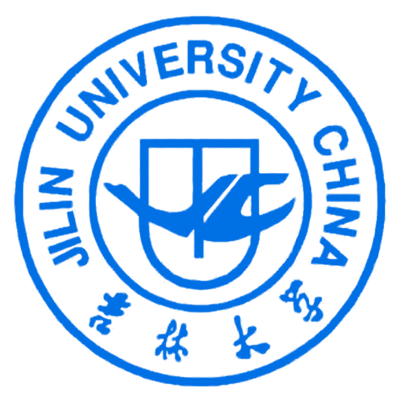
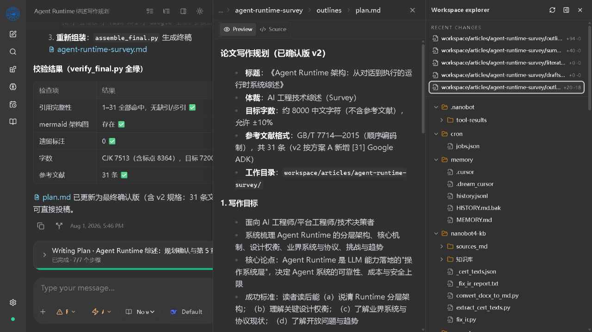
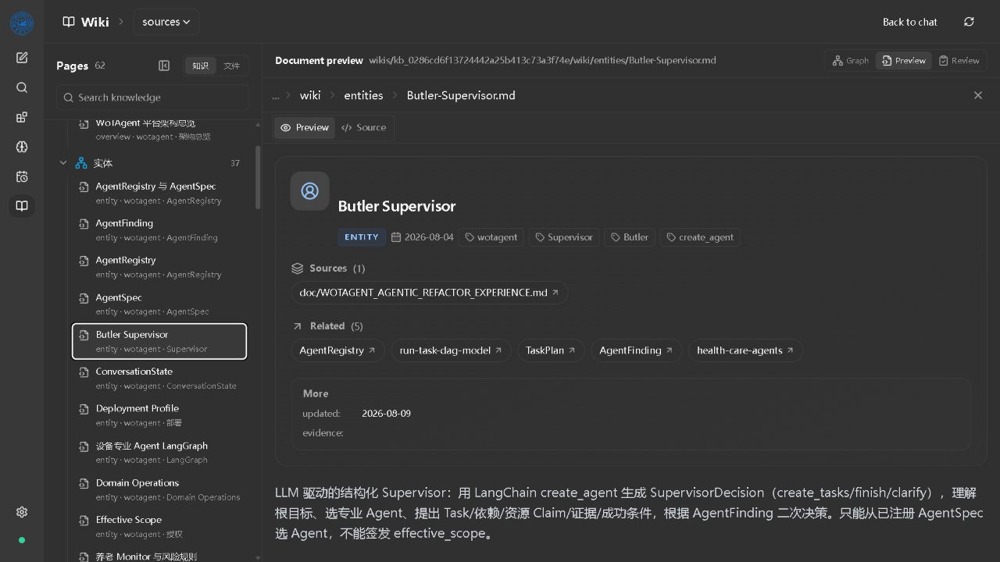
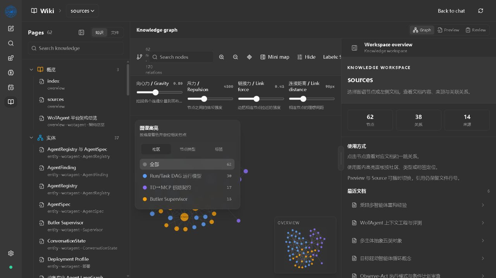
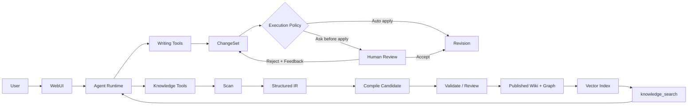

<div align="center">
  

  <h1>JLU Writing Agent</h1>

  <p><strong>面向长文档、知识资产与 Human-in-the-loop 审阅的交互式 AI 工作台</strong></p>
  <p>让 Agent 不只回答问题，而是持续创建、检索、修改、审阅并演化文档资产。</p>

  <p>
    
    
    
    
    <a href="./LICENSE"></a>
  </p>
</div>

> 本项目是基于开源项目 [nanobot](https://github.com/HKUDS/nanobot) 的个人二次开发，重点探索 Writing Agent、Interactive Document Workspace、Knowledge Runtime 与 Tool-based RAG。它不是吉林大学官方项目；校徽仅用于个人学习项目的身份标识。

## 为什么做这个项目

通用 Agent 已经能够调用文件工具，但“能写文件”并不等于“能管理一篇持续演化的文章”。长篇写作还需要稳定的任务计划、可审阅的修改、历史版本、证据引用，以及在知识不足时向用户自然地索取补充材料。

JLU Writing Agent 在保留 nanobot 轻量 Agent Runtime 的基础上，将能力延伸到两个领域：

- **Writing Runtime**：把文件修改升级为 `Document → Chapter → ChangeSet → Revision → Review`。
- **Knowledge Runtime**：把原始资料升级为带来源、关系和检索索引的结构化 Wiki。

核心原则是：**不重写 AgentLoop / AgentRunner，通过 Tool、Service、Runtime Context 与 WebUI Adapter 扩展领域能力。**

## 产品体验

### 1. Conversation × Document Workspace

聊天、文档预览和 Workspace Explorer 保持联动。Agent 修改了什么、文档现在是什么状态、最近有哪些变更，都可以在同一个任务中持续追踪。

<p align="center">
  
</p>

支持 Markdown、TXT、Python、LaTeX、JSON 等文本资产的 Preview / Source 切换；文件片段可以按路径与行号引用回输入框。

### 2. Structured Wiki

知识页不是一段无来源的生成文本。页面保留类型、标签、来源、关联文档和元数据，并可从 Preview 跳转到 Source 或 Related 页面。

<p align="center">
  
</p>

### 3. Knowledge Graph Workbench

Wiki 与 Cytoscape.js 图谱共享同一份知识数据。图谱支持社区、节点类型和标签三种高亮维度，并提供节点聚焦、邻居联动、Mini map 与布局参数调节。

<p align="center">
  
</p>

## 核心能力

| 能力 | 当前实现 |
|---|---|
| Agent Runtime | 多轮 LLM Tool Calling、Session、Memory、Working Plan、Goal、Runtime Events |
| Interactive Workspace | 文件树、最近修改、文档预览、Source / Preview、行号引用、可调宽度面板 |
| Writing Domain | WritingProject、Document、Chapter、Artifact、ChangeSet、Revision、Review |
| 文件修改策略 | Read-only、Ask before apply、Auto apply |
| Human-in-the-loop | Diff 预览、批准、拒绝与反馈闭环；批准后生成 Revision |
| Knowledge Engineering | `scan → extract(IR) → compile → validate/review → publish` |
| Structured Wiki | entity、concept、source、comparison、query、synthesis 与 frontmatter 元数据 |
| Knowledge Graph | 稳定节点/边、社区、中心性、按类型/标签/社区着色与文档联动 |
| Tool-based RAG | `knowledge_search` / `knowledge_research`，Hybrid Retrieval 与图关系扩展 |
| 检索个性化 | Auto / Manual、Top-K、Vector / Graph / Hybrid、Query Rewrite、Expand Hops |

## 两条核心数据链路



### Writing Runtime

```text
Agent proposes a change
        ↓
ChangeSet(base_revision + diff + reason + evidence)
        ↓
Auto Apply / Human Review
        ↓
Immutable Revision
        ↓
Compare / Restore / Continue Writing
```

### Knowledge Runtime

```text
raw sources
    ↓ scan + manifest
bounded extraction / normalization / OCR
    ↓
Knowledge IR + evidence
    ↓ compile candidate
validate / review / approve
    ↓
Wiki + graph.json + vector index
    ↓
knowledge_search / knowledge_research
```

知识库不会整体塞进模型上下文。Agent 在需要事实、概念、实体或关系时调用检索工具，仅返回有界的文档、片段、关系与引用。

## Hybrid RAG

当前检索器将本地向量检索、关键词匹配和 Graph Expansion 组合为一个稳定的工具接口：

```text
Query
  ├─ Vector Search
  ├─ Lexical Search
  └─ Graph 1-hop / 2-hop Expansion
            ↓
        Merge + Rank
            ↓
Bounded documents + relations + citations
```

- 默认提供无需额外模型的 `feature_hash` 后端，便于开发和测试。
- 可选 `fastembed` 后端使用 BGE 系列语义向量模型；切换模型后需要重建索引。
- Hybrid 排名当前以向量分数为主、关键词分数为辅；Graph 用于补充结构关系，而不是替代事实证据。
- `knowledge_research` 支持 Agent 提交少量改写 Query，并在预算范围内合并结果。

> FAISS / Chroma 属于后续可替换的向量存储实现，不进入 Agent 核心循环。当前实现优先保证接口、评测与可解释性，再决定是否引入更重的索引依赖。

## 快速开始

### 环境要求

- Python 3.11+
- Bun（用于构建 WebUI）
- 一个可用的 LLM Provider

### Windows

```powershell
git clone https://github.com/GoldenGYQ/writingagent.git
cd writingagent

python -m venv .venv
.\.venv\Scripts\Activate.ps1
python -m pip install -e ".[dev,knowledge]"

cd webui
bun install
bun run build
cd ..

nanobot webui
```

启动后按终端提示打开本地 WebUI，在 Settings 中配置模型与 Workspace。

### 开发命令

```powershell
# Gateway
.\.venv\Scripts\nanobot.exe gateway

# WebUI development server
cd webui
bun run dev

# Knowledge / Writing focused tests
cd ..
.\.venv\Scripts\python.exe -m pytest tests/knowledge -q

# Frontend tests and production build
cd webui
bun run test
bun run build
```

## 如何体验

### 文档工作区

1. 在侧边栏创建或选择一个 Project Workspace。
2. 发起写作任务，或让 Agent 创建 Markdown 文档。
3. 点击顶部 Workspace 图标打开文档工作区。
4. 从 Recent Changes 或文件树打开文档，在 Preview / Source 间切换。
5. 选择文档片段，将 `{path, start_line, end_line, quote}` 引用加入输入框。

### ChangeSet 与审批

- **Read-only**：只允许读取，不应用修改。
- **Ask before apply**：先生成 Diff / ChangeSet，等待接受或拒绝反馈。
- **Auto apply**：直接应用修改，同时保留 Revision 与变更记录。

### 结构化知识库

在对话中选择或创建 Knowledge Project，然后让 Agent 按知识工程流水线处理资料：

```text
knowledge_scan
  → knowledge_extract
  → knowledge_compile
  → knowledge_validate
  → knowledge_publish
```

发布后可在 Wiki 页面浏览结构化文档与图谱，也可以在普通对话中由 Agent 调用 `knowledge_search`。

## 项目结构

```text
nanobot/
├── nanobot/
│   ├── agent/                 # AgentLoop、AgentRunner 与 Tools
│   ├── writing/               # Document / ChangeSet / Revision / Review
│   ├── knowledge/             # IR、Compiler、Graph、Indexer、Retriever
│   ├── session/               # Session、Compaction 与 Goal State
│   └── webui/                 # WebUI HTTP / WebSocket adapters
├── webui/src/
│   ├── components/thread/     # Conversation、Timeline、HITL cards
│   ├── components/wiki/       # Wiki、Graph、Document details
│   └── components/            # FilePreviewPanel 等通用组件
├── tests/knowledge/           # Knowledge/Writing Runtime tests
├── docs/                      # 设计、开发日志与实验记录
└── images/product/            # README 产品截图
```

## 当前边界与路线图

### 已完成

- Interactive Document Workspace 与文件片段引用
- Writing Domain Model、ChangeSet、Revision、Review
- 文件修改策略与 HITL 审批闭环
- 结构化 Wiki、Graph Community 与文档联动
- Tool-based Hybrid RAG、Graph Expansion 与检索参数设置

### 实验性

- DOC / DOCX / PDF 归一化
- OCR、图片标签与多模态 Evidence
- 大文档的有界读取、分批抽取与知识补充交互
- RAG Benchmark、阈值扫描与 Embedding 后端对比

### 下一步

- 面向 600MB 级复合标书的流式拆解与断点恢复
- 语义 Diff、章节级 Review 与引用一致性检查
- 检索结果可视化和 Recall@K / MRR / 无结果率评测面板
- 知识缺口驱动的 `Request User Input` 与材料补充工作流

相关设计与实验记录：

- [Knowledge Runtime 开发计划](./docs/knowledge-runtime-development-plan.md)
- [Knowledge RAG 开发日志](./docs/knowledge-rag-development-log.md)
- [Knowledge Retrieval 实验](./docs/knowledge-retrieval-experiments.md)

## Upstream 与许可证

本项目保留并复用 nanobot 的通用 Agent Runtime、Provider、Channel、Session、Memory、Tools 与 WebUI 基础设施，在其之上增加 Writing / Knowledge 领域能力。

- Upstream: [HKUDS/nanobot](https://github.com/HKUDS/nanobot)
- Personal fork: [GoldenGYQ/writingagent](https://github.com/GoldenGYQ/writingagent)
- License: [MIT](./LICENSE)

感谢 nanobot 原作者与所有开源贡献者。二次开发内容以学习、研究和工程实践为目的。
