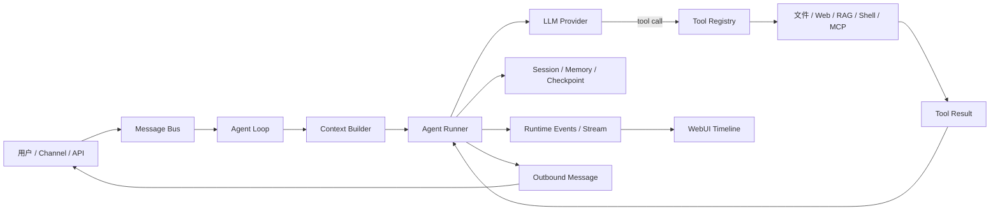

# AI Agent / AI 应用工程师模拟面试技术问答

> 面向岗位：AI 应用工程师、LLM 应用工程师、Agent 工程师、AI 平台工程师、后端转 AI。
>
> 目标：把“会调用模型”讲成“能设计、实现、评估和运营一个可靠的 AI 应用系统”。
>
> 使用方式：先只看问题，口头回答 2～3 分钟；再对照“推荐回答”；最后用“追问”和“取舍”检查自己是否真的理解。

## 0. 这份题库从哪里来

公开面经和岗位资料反复出现的考察维度主要是：大模型基础、Prompt/Context Engineering、RAG 全链路、Agent Loop、Tool Calling、MCP、系统设计、安全、评测和项目落地。公开资料只能说明常见方向，不能当作任何公司的固定题库；真正面试时应以目标岗位 JD 和面试官追问为准。

参考资料：

- [AI 智能体与大模型应用开发面试题库（GitHub）](https://github.com/didilili/ai-agents-from-zero/blob/main/AI智能体与大模型应用开发面试题库.md)
- [AI 应用开发面试题专题（JavaGuide）](https://javaguide.cn/ai/interview-questions/)
- [AI Agent 工程师 40+ 真题整理（博客园）](https://www.cnblogs.com/itech/p/20111938)
- [字节跳动 AI 应用开发面经（NiceOffer）](https://niceoffersz.com/intv/bytedance-ai-application-dev-1)
- [Anthropic：Building Effective AI Agents](https://www.anthropic.com/engineering/building-effective-agents)
- [Model Context Protocol 规范](https://modelcontextprotocol.io/specification/2025-06-18/server/index)
- [LangGraph：Persistence](https://langchain-ai.github.io/langgraph/concepts/persistence/)
- [OpenAI Evals / Graders API](https://platform.openai.com/docs/api-reference/evals)

## 1. 面试回答总原则

不要只背名词。一个合格的工程化回答通常按下面顺序展开：

1. **先定义问题**：输入、输出、约束、规模、可靠性目标是什么？
2. **给最小可行方案**：先说明单 Agent、确定性流程或简单 RAG 是否已经足够。
3. **讲数据流**：用户输入如何进入，模型如何决策，工具如何执行，结果如何回到上下文。
4. **讲失败处理**：超时、重试、幂等、工具错误、上下文超限、模型拒答怎么办？
5. **讲评测指标**：准确率、引用正确率、任务成功率、工具成功率、延迟、成本和安全事件如何测？
6. **讲取舍**：为什么选择这个模型、框架、存储和编排方式，为什么暂时不用另一种方案？
7. **落到项目证据**：指出代码位置、一次真实问题、如何定位、如何验证改动。

推荐的项目叙事结构：

> 背景与约束 → 初始方案 → 真实问题 → 定位方法 → 关键改动 → 指标变化 → 仍然存在的限制 → 下一步。

## 2. 初级：基础概念与最小实现

### Q1：什么是 LLM 应用工程师？和传统后端或算法工程师有什么区别？

**推荐回答：**

LLM 应用工程师负责把模型能力嵌入一个可用、可测、可运营的软件系统。工作不只是 Prompt，还包括模型接入、上下文构造、RAG、工具调用、服务接口、权限、安全、流式输出、持久化和评测。与传统后端相比，系统输出具有概率性，需要处理幻觉、模型版本和 Token 成本；与纯算法岗位相比，重点通常不在从零训练基础模型，而在任务建模、工程集成和线上可靠性。

**追问：**“Prompt 写得好是不是就够了？”

答：不够。Prompt 只能影响模型决策，不能替代权限、参数校验、事务、审计和结果验证。高风险动作必须由程序边界控制；知识问答要评测检索和引用，而不是只看语言是否流畅。

### Q2：Chatbot、Workflow 和 Agent 有什么区别？

**推荐回答：**

- Chatbot：输入消息，模型生成回复，流程通常是单轮或固定多轮。
- Workflow：步骤、分支和数据流由代码预先定义，模型只负责某些节点，例如分类、抽取或生成。
- Agent：模型根据目标和当前观察结果动态决定下一步，可能选择工具、继续循环、改变计划或请求用户输入。

我会优先从 Workflow 开始，只有当任务路径确实需要动态决策时才引入 Agent。路径固定却使用 Agent，会增加延迟、成本和不可预测性。

### Q3：什么是 ReAct Loop？

**推荐回答：**

最小 ReAct Loop 可以抽象为：

```text
读取目标和上下文
  → 请求模型
  → 如果模型返回工具调用：校验参数并执行工具
  → 把 Tool Result 追加回上下文
  → 再请求模型
  → 直到最终回答、错误、取消、等待用户或达到上限
```

模型不是直接执行代码，而是产生结构化的工具调用；宿主程序执行工具，再把结果作为新的消息交还模型。循环必须有最大迭代次数、超时、取消和错误策略。

### Q4：Function Calling 和普通 JSON 输出有什么区别？

**推荐回答：**

Function Calling 是模型输出一个带名称和参数的调用意图，应用程序根据 schema 找到真实函数并执行。普通 JSON 只是文本格式，仍然需要解析、校验和判断它是否代表动作。生产系统不能因为模型返回了看似合法的 JSON 就直接执行，必须做工具名白名单、JSON 解析、类型转换、业务校验和权限检查。

### Q5：Token、上下文窗口和 temperature 分别是什么？

**推荐回答：**

Token 是模型处理文本的基本单位；上下文窗口是一次请求可容纳的输入、工具定义、历史和输出总量；temperature 影响采样随机性。上下文窗口不是“无限记忆”，而是单次调用预算。工程上还要关注工具 schema、检索文档和历史消息占用的 Token，以及输入和输出分别计费的成本。

### Q6：为什么模型会幻觉？如何降低？

**推荐回答：**

幻觉来自训练知识不完整、上下文缺失、问题歧义、检索错误和模型倾向于生成看似合理的答案。降低方法是：限定任务边界；使用可靠检索并要求引用；对事实性输出采用结构化 schema；让模型在证据不足时拒答或澄清；对工具和数据库结果做程序校验；用离线数据集评测而不是凭感觉。

## 3. 中级：RAG、工具和上下文

### Q7：请设计一个企业知识库问答系统。

**推荐回答：**

```text
文件上传
  → 解析与清洗
  → 按结构切片
  → Embedding
  → 向量/关键词索引
  → 召回
  → Rerank
  → 上下文拼装
  → LLM 生成带引用答案
  → 评测与反馈
```

在线链路和离线链路要分开。离线链路负责解析、切片、索引和版本；在线链路负责查询改写、召回、重排、上下文限制和生成。每个 chunk 应保存文档 ID、页码或行号、版本和权限信息，保证答案可以追溯。

**为什么不只用向量搜索？**

向量搜索擅长语义相似，但对精确编号、日期、产品型号和布尔条件不一定稳定。企业场景常用混合检索，再用 reranker 和权限过滤做最后收敛。

### Q8：Chunk 应该多大？

**推荐回答：**

没有通用固定值。应根据文档结构、查询类型、模型上下文和评测结果选择。优先按标题、段落、表格和代码块等语义边界切分，必要时保留适度重叠。过小会丢失语义，过大会降低召回精度并浪费 Token。最终以 Recall@K、引用正确率、答案完整性和延迟共同决定。

### Q9：如何判断是“检索错”还是“生成错”？

**推荐回答：**

把链路拆开评测。先检查 gold evidence 是否出现在 Top-K；如果没有，是查询改写、切片、Embedding、过滤或 rerank 问题。如果证据已被召回但回答错误，才重点检查上下文拼装、指令冲突、模型能力和输出校验。不要只用最终答案准确率定位问题。

### Q10：Tool 如何设计？

**推荐回答：**

工具应该是小而明确的能力边界，输入输出结构稳定，描述说明何时使用和何时不要使用。参数 schema 负责结构约束，程序负责业务约束和权限约束。工具返回应该包含机器可读状态、用户可读摘要、必要的错误码和可追溯 ID，避免把巨大的原始结果无条件塞回上下文。

一个工具至少需要考虑：

- 名称是否稳定、是否唯一；
- 参数是否可枚举和可校验；
- 是否只读或有副作用；
- 是否需要审批；
- 超时、重试和幂等；
- 输出截断和敏感信息脱敏；
- 审计日志和调用者身份。

### Q11：Skill、Tool 和 MCP 有什么区别？

**推荐回答：**

- Tool 是一次可调用的动作，例如 `search_documents(query)`。
- Skill 是一组面向任务的说明、流程或可复用能力，通常可以按需加载，减少常驻上下文。
- MCP 是连接模型客户端与外部服务的协议，提供 Tools、Resources、Prompts 等原语。

它们不是互斥关系：Skill 可以指导 Agent 何时调用 Tool；Tool 可以由本地代码提供，也可以通过 MCP 暴露；Resource 更像由应用注入的上下文，而不是模型自由执行的动作。MCP 规范把 Prompts、Resources、Tools 分别放在用户控制、应用控制和模型控制的层次上，这对权限设计很有帮助。

### Q12：短期上下文、长期记忆和工作空间有什么区别？

**推荐回答：**

- 短期上下文：当前会话和当前运行需要的消息、工具调用、观察结果、临时计划。
- 长期记忆：跨会话仍然有价值的用户偏好、事实、项目知识或摘要。
- 工作空间状态：文件、数据库、任务记录、产物和版本等外部事实。

三者不能混为一谈。把所有内容都放进 Prompt 会导致上下文膨胀；把文件变化只写进记忆又会丢失真实状态。长期记忆需要来源、更新时间、置信度和删除策略；工作空间应该由工具或数据库查询确认。

### Q13：如何做 Context Engineering？

**推荐回答：**

Context Engineering 不只是把更多文本塞进 Prompt，而是为当前决策选择最小且相关的信息。实践包括：系统指令分层、按需加载 Skill、只检索相关文档、压缩旧工具结果、保留任务状态、隐藏内部噪声、限制工具返回长度和在上下文接近上限时主动总结。每一次上下文注入都应能回答“它为什么对当前决策有用”。

## 4. 中高级：模型选择与工程取舍

### Q14：如何选择模型？

**推荐回答：**

我不会先按排行榜选模型，而会先定义任务矩阵：复杂推理、工具调用、结构化输出、长上下文、多模态、延迟、成本、数据合规和可用区域。然后用同一评测集比较候选模型，至少记录任务成功率、引用准确率、工具参数正确率、平均/尾延迟、Token 成本和失败率。

常见分层是：

- 复杂规划、代码和研究：高能力模型；
- 分类、抽取、改写和轻量工具路由：小模型；
- 简单摘要或高并发：低成本模型；
- 高风险动作：模型只负责提出结构化意图，最终由确定性代码和审批控制。

模型名称会快速变化，因此面试中应说“基于评测选择某类模型”，而不是把某个型号当成永久答案。

### Q15：什么时候用微调，什么时候用 RAG 或 Prompt？

**推荐回答：**

- 新知识、可变知识、权限知识：优先 RAG。
- 输出格式、语气、分类边界和稳定行为：先 Prompt/结构化输出，数据充分后考虑微调。
- 工具执行和业务规则：用程序校验，不要试图靠微调替代权限系统。
- 需要模型掌握领域语言或固定任务模式，且有足够高质量样本：再评估 LoRA/微调。

微调不是知识库更新机制，也不能天然解决事实时效和工具安全问题。

### Q16：如何降低延迟和成本？

**推荐回答：**

先测量，再优化。常见措施包括：减少不必要的 Agent 迭代；对简单路由使用小模型；并行化独立检索；限制工具结果；缓存稳定的 Prompt 前缀和检索结果；流式返回；设置超时和预算；对失败重试采用指数退避；避免把整个历史重复发送。优化后仍要用评测集确认质量没有下降。

### Q17：为什么不直接使用多智能体？

**推荐回答：**

多智能体可以通过专业分工、并行探索或独立审查提高复杂任务质量，但会增加通信 Token、调度复杂度、状态同步和调试难度。我的默认策略是先做单 Agent + 清晰工具；只有出现职责隔离、并行收益、独立上下文或不同模型配置等明确需求时才拆分子 Agent。

## 5. 高级：Runtime、持久化和可靠性

### Q18：如何设计一个可恢复的 Agent Runtime？

**推荐回答：**

我会把一次运行拆成可观察的状态转移：`received → planning/llm → tool_call → tool_result → waiting/continue → completed/failed/cancelled`。每个有副作用的步骤都要有 Run ID、Step ID、输入摘要、输出引用、状态和时间戳。关键边界保存 checkpoint，重启后可以从最后一个安全点恢复，而不是重新执行所有动作。

工具副作用必须幂等，例如使用幂等键、upsert 或执行前查询。外部 API 调用不能只依赖“模型说已经成功”，必须根据真实响应确认。

### Q19：Agent 的持久化应该保存什么？

**推荐回答：**

至少区分：

1. 会话消息和可见历史；
2. 当前 Run 的状态、迭代、计划和工具调用；
3. 工具结果或外部资源引用；
4. 用户批准、取消和反馈；
5. 最终产物及其版本；
6. 审计和指标。

不要把所有运行数据都拼成一条字符串。结构化事件和引用可以支持恢复、重放、时间线展示和问题定位。

### Q20：如何处理上下文窗口溢出？

**推荐回答：**

分层处理：先裁剪重复或低价值工具结果，再压缩旧对话和已完成步骤，保留当前目标、约束、未完成任务、关键证据和最近的工具边界。压缩必须可追踪，不能静默删除用户要求。若仍然超限，应该暂停并请求用户缩小范围，或拆成多个可恢复的子任务。

### Q21：如何做 Human-in-the-loop？

**推荐回答：**

审批点应放在有副作用或高风险的工具之前，而不是所有普通回复之前。审批信息要明确展示动作、目标、参数、影响范围和风险；用户可以批准、拒绝或修改参数。审批状态应持久化，恢复时使用同一个 Run/Thread ID，避免重复执行。

### Q22：如何做安全设计？

**推荐回答：**

安全边界不能只写在系统 Prompt 里。至少包括：工具白名单、工作区路径隔离、命令沙箱、网络和凭证最小权限、参数校验、敏感信息脱敏、用户审批、审计、超时、速率限制和取消。对外部文档要防 Prompt Injection：把文档内容当不可信数据，不把其中的指令提升为系统指令。

### Q23：如何设计 Trace / Event？

**推荐回答：**

事件至少要能回答：谁在什么时间、对哪个 Run、执行了哪个阶段、使用了哪个模型或工具、输入输出是什么、耗时多少、结果是否成功、为什么继续或停止。事件应使用稳定类型和 JSON payload，例如 `run_started`、`llm_started`、`tool_called`、`tool_completed`、`context_compacted`、`approval_requested`、`run_completed`。前端只消费事件，不应从自然语言回复中猜测运行状态。

## 6. 系统设计题

### Q24：请设计一个 Research Agent。

**推荐回答框架：**

```text
用户问题
  → 需求澄清与范围确认
  → 研究计划
  → 查询改写 / 多源检索
  → 页面抓取与证据抽取
  → 去重、排序、冲突检测
  → 分段总结并保留引用
  → 事实核查与缺口检查
  → 生成报告
  → 用户审阅与修订
```

关键设计点：证据和结论分开存储；每条结论保留来源、时间和定位；网络失败可重试；不允许无来源的事实被包装成确定结论；长任务需要 checkpoint 和取消；用户可以在最终发布前审阅。

### Q25：请设计一个 Writing Agent。

**推荐回答：**

写作 Agent 不应把 8000 字一次性生成。建议拆成：需求确认 → 大纲 → 章节计划 → 资料和引用 → 分章草稿 → 一致性检查 → 语言润色 → 用户审阅 → 版本发布。文章状态应放在工作空间的结构化文件或数据库中，章节和引用有稳定 ID，修改产生 revision/diff，Review 输出问题清单而不是直接覆盖原文。

### Q26：如何设计 Agent 的 API？

**推荐回答：**

至少提供：创建 Run、读取 Run、发送用户输入、取消 Run、恢复等待中的 Run、读取事件流、读取会话消息和读取产物。API 使用稳定的 `run_id`、`thread_id` 和 `event_id`；事件流支持断线后按游标续传；命令和工具权限由服务端校验，不能由前端决定。

## 7. 项目深挖：结合 nanobot 回答

### Q27：请介绍 nanobot 的核心执行链路。

**推荐回答：**

nanobot 将通道接入与 Agent Core 解耦。消息先进入异步 `MessageBus`，`AgentLoop` 负责会话、上下文、命令和一次回合的产品级编排，`AgentRunner` 负责 `LLM → tool call → tool result → LLM` 的执行循环，Provider 负责模型适配，ToolRegistry 负责工具注册、schema 和执行，结果再通过 OutboundMessage 返回通道。

可用代码入口：

- [`AgentLoop`](../nanobot/agent/loop.py#L181)
- [`AgentRunner`](../nanobot/agent/runner.py#L142)
- [`ToolRegistry`](../nanobot/agent/tools/registry.py#L19)
- [`MessageBus`](../nanobot/bus/queue.py#L1)
- [`ContextBuilder`](../nanobot/agent/context.py#L54)

### Q28：nanobot 的 Agent Loop 是不是一个真正的多智能体系统？

**推荐回答：**

核心默认是单 Agent Loop，但它提供 `SubagentManager` 和 `SpawnTool` 创建受限的子 Agent。子 Agent 通常是父 Agent 通过工具启动的独立运行单元，拥有自己的任务上下文和执行过程，完成后把结果回传父会话。它不是天然的 Swarm，也不意味着所有请求都会并行拆分。

代码入口：[`SubagentManager`](../nanobot/agent/subagent.py#L89)、[`SpawnTool`](../nanobot/agent/tools/spawn.py#L48)。

### Q29：nanobot 如何维护上下文？

**推荐回答：**

它把会话历史、系统提示、技能摘要、运行时上下文、工具结果和压缩摘要组合成模型请求。会话通过 JSONL 存储；`ContextBuilder` 负责构建系统和历史上下文；`MemoryStore` 负责 MEMORY.md、USER.md、SOUL.md 和历史归档；上下文治理负责在接近窗口上限时压缩工具结果或旧消息。

重要的是区分：JSONL 会话是短期对话持久化，Memory 文件是长期记忆，工作区文件是外部事实，三者并不是同一个东西。

代码入口：[`ContextBuilder`](../nanobot/agent/context.py#L54)、[`MemoryStore`](../nanobot/agent/memory.py#L73)、[`JsonlSessionStore`](../nanobot/session/manager.py#L486)、[`ContextGovernor`](../nanobot/agent/context_governance.py#L1)。

### Q30：nanobot 的 Tool Calling 如何保证参数正确？

**推荐回答：**

工具先注册到 `ToolRegistry` 并生成 schema。模型返回工具名和参数后，Registry 先解析和规范化参数，再进行类型转换和校验；工具不存在或参数不合法时返回结构化错误，而不是直接执行。工具执行结果再作为 Tool Result 回到 Runner 的下一轮模型输入。

这解决了“模型输出像函数调用”与“程序真的执行函数”之间的边界问题，但权限、沙箱和副作用安全仍应由具体工具和服务层继续控制。

### Q31：如果面试官问“为什么不用 LangGraph / AutoGen / CrewAI”，怎么答？

**推荐回答：**

框架选择要看目标，而不是追逐名词。nanobot 的优势是内核小、Provider/Channel/Tool 边界清楚、适合学习和定制；如果项目需要图结构编排、强持久化、复杂 HITL 和可视化调试，可以评估 LangGraph；如果重点是快速多 Agent 原型，可以评估其他框架。但引入框架会带来抽象、版本和迁移成本，我会先用现有 Runtime 验证需求，再针对缺口引入最小依赖。

### Q32：nanobot 当前最适合做什么，不适合做什么？

**推荐回答：**

适合：多轮对话、工具调用、文件和命令操作、Web 搜索、技能扩展、子 Agent、Markdown 写作辅助和本地知识工作流原型。

需要扩展：强事务工作流、复杂 DAG 编排、跨进程可靠恢复、细粒度审批、完整 Artifact/Revision 模型、企业级租户隔离、端到端 Trace 分析和高并发分布式调度。

面试时不要把“有工具”说成“已经具备完整平台能力”，要明确当前事实和未来扩展边界。

## 8. 现场编程题

### Q33：实现一个最小 Agent Loop

```python
async def run_agent(messages, model, tools, max_steps=8):
    for step in range(max_steps):
        response = await model.complete(messages, tool_schemas=tools.schemas())
        if not response.tool_calls:
            return response.text

        messages.append(response.as_assistant_message())
        for call in response.tool_calls:
            tool = tools.get(call.name)
            if tool is None:
                result = {"ok": False, "error": "unknown_tool"}
            else:
                try:
                    args = tool.validate(call.arguments)
                    result = await tool.execute(**args)
                except Exception as exc:
                    result = {"ok": False, "error": str(exc)}
            messages.append(tool_result_message(call.id, result))
    raise RuntimeError("agent iteration limit exceeded")
```

面试时要主动补充：超时、取消、并行工具、重试、工具结果截断、幂等、审计和上下文压缩。

### Q34：实现一个工具重试策略时要注意什么？

**推荐回答：**

只有瞬时错误适合自动重试，例如网络超时或 429；参数错误、权限错误和业务拒绝不应盲目重试。使用指数退避、最大次数和总预算；对有副作用的操作必须提供幂等键。重试次数和最终错误要进入事件记录。

### Q35：如何测试 Agent，而不是只测普通函数？

**推荐回答：**

分层测试：工具单元测试；Runner 使用 fake model/fake tool 测试循环；上下文测试验证压缩后仍保留关键约束；端到端测试验证真实 Provider、API 和事件流；离线评测使用固定任务集比较模型、Prompt 和检索版本。随机模型不能替代可重复的回归集。

## 9. 发展历程类问题

### Q36：请讲一个你从零开发 Agent 的过程。

**推荐回答模板：**

> 第一阶段先做单轮模型调用，验证业务问题和输出格式；第二阶段把外部能力抽象成 Tool，并加入 schema 校验；第三阶段引入 RAG 或工作空间状态；第四阶段加入 Agent Loop、上下文治理和流式事件；第五阶段补充评测、安全、持久化和失败恢复。每一步都保留可运行版本，用指标判断是否值得增加复杂度。

不要说“我一开始就做多智能体平台”。这通常会让面试官继续追问：为什么需要？如何验证？失败如何恢复？

### Q37：你遇到过最难定位的 Agent 问题是什么？

**推荐回答结构：**

1. 现象：例如工具调用成功率下降或上下文溢出。
2. 证据：通过 Run ID、事件时间线和原始请求发现问题出在检索/拼装，而不是模型本身。
3. 修复：限制工具结果、保留工具边界、调整 schema 或加入重试/超时。
4. 验证：用回归集和线上指标确认成功率、延迟和成本变化。
5. 复盘：把修复沉淀为测试、监控或设计约束。

### Q38：什么时候应该停止增加 Agent 能力？

**推荐回答：**

当新增的规划、子 Agent 或工具只增加成本和失败面，却没有改善任务成功率、可解释性或用户体验时，应停止扩展。把系统退回确定性 Workflow 或单 Agent，往往是更成熟的工程决策。

## 10. 常见追问速答

| 追问 | 推荐回答关键词 |
|---|---|
| 为什么要流式输出？ | 降低首 Token 感知延迟；但工具事件、最终状态仍需结构化传递 |
| 工具结果太大怎么办？ | 服务端摘要、分页、引用外部资源、限制字符数 |
| 模型说“已写入文件”可信吗？ | 不可信；必须检查工具真实返回和文件状态 |
| 多个工具能并行吗？ | 只有依赖关系独立且副作用安全时并行 |
| 失败后从哪里恢复？ | 从持久化 checkpoint 或最后一个幂等边界恢复 |
| 为什么需要模型路由？ | 按任务复杂度、成本、延迟和能力选择模型 |
| Prompt Injection 怎么办？ | 不可信数据隔离、工具权限、输出校验、审批和审计 |
| 评测为什么不能只看 BLEU？ | Agent 需要任务成功、工具正确、引用、事实性和安全指标 |
| 什么时候使用向量数据库？ | 语义召回需求明显且规模/更新模式值得引入时；小数据可先用数据库全文检索 |
| Agent 的“思考过程”要不要展示？ | 展示可审计事件和行动摘要，不泄露敏感内部推理或把自然语言当状态机 |

## 11. 面试官可能要求你画的架构图



讲图时要强调：模型负责提出下一步意图，Runtime 负责执行边界、状态和恢复；工具结果不是最终答案，必须回到模型或确定性后处理；事件流是 UI 观察面的投影，不等同于会话正文。

## 12. 复习路线

### 初级目标

- 能解释 Token、上下文窗口、temperature、Function Calling。
- 能手写一个带最大迭代次数的 Agent Loop。
- 能说清 Chatbot、Workflow、Agent 的边界。

### 中级目标

- 能设计 RAG 全链路并定位召回错与生成错。
- 能设计 Tool schema、参数校验、重试和幂等。
- 能区分短期上下文、长期记忆和工作空间。
- 能解释模型选择、成本、延迟和评测。

### 高级目标

- 能设计可恢复的长任务 Runtime。
- 能处理 HITL、权限、Prompt Injection 和审计。
- 能设计事件模型、流式接口和 Trace。
- 能比较单 Agent、多 Agent、Workflow 及框架引入成本。
- 能用一个真实项目讲清从问题到指标的完整开发历程。

## 13. 最后给自己的答题检查表

每道系统设计题至少回答以下 10 个问题：

1. 输入和输出是什么？
2. 任务是否真的需要 Agent？
3. 模型在哪里调用？
4. 工具如何注册和校验？
5. 上下文如何构建和压缩？
6. 状态如何保存和恢复？
7. 哪些动作需要审批？
8. 失败、重试和取消怎么做？
9. 如何评测质量、成本和延迟？
10. 当前方案的边界和下一步是什么？

能够同时回答这十个问题，通常就不再是“只会调 API”，而是在展示 Agent 应用工程能力。

## 14. 目标态项目面试口径：把未来能力作为“已完成项目”演练

> 本节是面试模拟稿。为了方便练习，答案使用“我们已经完成”的过去式叙述；它描述的是 nanobot Writing/Research Agent 目标态，而不是当前仓库所有代码都已经具备的事实。正式面试前，应把其中的组件名、指标、部署规模和故障案例替换成自己真实做过并能提供证据的内容。

### 14.1 90 秒项目介绍

**面试官：请介绍一个你做过的 Agent 项目。**

**模拟回答：**

我负责把 nanobot 扩展成一个面向知识工作场景的 Agent Runtime，重点支持 Research Agent 和 Writing Agent。系统不是简单的聊天机器人，而是把用户目标拆成可恢复的运行步骤：模型负责规划和选择工具，Runtime 负责上下文、工具执行、持久化、事件流和安全边界。

在 Research 场景，Agent 可以检索多源资料、保留证据锚点、生成带引用的研究结果，并在证据不足或来源冲突时标记问题。在 Writing 场景，Agent 可以维护文档、章节、Revision、Review 和 ChangeSet，先生成候选修改，再根据用户审批应用。

架构上我们保留了 nanobot 的 `AgentLoop`、`AgentRunner`、`ToolRegistry`、Session 和 Provider 边界，只在领域层增加知识和写作 Runtime Context、结构化产物和审批流程。我们重点解决了三个问题：长任务不能丢状态，工具副作用不能失控，模型质量必须能通过事件和评测定位。

### 14.2 初级技术问答

#### Q1：你们的 Agent 和普通聊天机器人有什么区别？

**模拟回答：**

普通聊天机器人主要是“消息进来，模型生成回复”。我们的 Agent 以目标为中心，模型可以在多轮循环中选择搜索、文件、知识库和写作工具；每次工具执行都有结构化结果，Runtime 会根据结果继续、暂停、重试或结束。我们没有把所有任务都做成 Agent，路径固定的流程仍然使用确定性代码。

**追问：为什么不所有功能都用 Agent？**

因为动态规划会带来额外延迟、成本和不可预测性。比如 ChangeSet 校验、版本号分配和权限检查都应该由程序完成，模型只负责提出意图或生成候选内容。

#### Q2：一次运行的生命周期是什么？

**模拟回答：**

一次 Run 会经历接收请求、恢复 Session、构建上下文、请求模型、解析 Tool Call、执行工具、保存 Checkpoint、发布 Runtime Event、继续下一轮，最后进入 completed、failed、cancelled 或 waiting 状态。我们用 `run_id`、`step_id` 和事件序号保证前端能够观察过程，重启后能够从最近的安全边界继续。

#### Q3：模型输出错误的工具名怎么办？

**模拟回答：**

模型返回的工具调用不会直接执行。我们先通过工具白名单解析名称，再校验 JSON 对象、字段类型、枚举、路径和业务约束。工具不存在或参数不合法时返回结构化错误，并给模型一次有限的纠正机会；多次失败会停止该 Run，而不是无限重试。

#### Q4：你如何防止 Agent 无限循环？

**模拟回答：**

我们使用多重限制：最大迭代次数、单次 LLM 超时、工具超时、外部检索重复限制、总 Token 预算和特定任务的时间预算。达到预算时会进入无工具收尾 Prompt；如果任务仍未完成，返回已完成步骤、未完成原因和下一步，而不是声称成功。

#### Q5：为什么需要事件流？

**模拟回答：**

自然语言回复不能可靠地表示运行状态。我们把模型请求、工具开始、工具结束、上下文压缩、审批等待、恢复和最终结果定义为结构化事件。WebUI 根据事件渲染时间线，后端也可以使用同一事件定位某一次失败，而不是从日志和聊天文本中猜测。

### 14.3 中级：RAG 与知识工程

#### Q6：你们的知识库处理链路是什么？

**模拟回答：**

我们把离线和在线链路分开。离线链路负责扫描源目录、解析文件、结构化抽取、保留证据锚点、编译候选 Wiki 和图谱、验证并等待发布。在线链路只检索已选择的知识项目，返回有路径、行号或页码的受限片段，再交给模型生成答案。

流程是：

```text
scan → extract → compile candidate → validate → review/approve → publish
```

这样做的原因是：生成 Markdown 不能直接成为事实来源，必须保留原始文件、结构化 IR、证据和审核状态。

#### Q7：如何判断 RAG 问题出在检索还是生成？

**模拟回答：**

我们把最终答案拆成检索评估和生成评估。先检查目标证据是否进入 Top-K；如果没有，检查切片、查询改写、过滤和排序。如果证据已进入上下文但答案错误，再检查上下文拼装、冲突证据处理、模型遵循程度和输出验证。这样可以避免把所有问题都归因于模型。

#### Q8：为什么保存引用，而不是只保存文本？

**模拟回答：**

只保存文本无法回答“这句话来自哪里、是否已经过期、用户是否有权限”。我们保存 `path`、`start_line`、`end_line`、`quote`、source version 和 project ID。引用既用于回答展示，也用于后续 Writing ChangeSet 的证据绑定。

#### Q9：向量数据库和全文检索怎么选？

**模拟回答：**

我们根据查询类型和规模选择。语义问题使用 Embedding 召回，编号、标准条款、产品型号和精确过滤使用全文或结构化查询；企业场景通常采用混合检索和 rerank。小规模本地知识库不一定马上引入向量数据库，先用可解释的全文检索验证任务价值。

#### Q10：如何处理权限？

**模拟回答：**

权限过滤必须发生在检索和工具层，而不是让模型“自觉不回答”。每个文档和引用都带项目、来源和权限边界；检索工具只返回当前会话可见的数据；最终输出还要检查是否泄露了不应出现的原文。模型看到的上下文永远是权限过滤之后的子集。

### 14.4 中级：Writing Agent

#### Q11：Writing Agent 的核心对象是什么？

**模拟回答：**

我们把写作过程建模为：`WritingProject → Document → Chapter → Revision → Review → ChangeSet`。正文不是直接覆盖文件，而是生成基于某个 Revision 的候选修改。Review 产生结构化问题，ChangeSet 保存统一 diff 和引用，用户审批后才应用。

这比让 Agent 直接调用 `write_file` 更适合长文写作，因为它支持局部修改、历史回溯、审批和并发版本冲突检测。

#### Q12：如何写一篇 8000 字综述？

**模拟回答：**

我不会一次生成 8000 字，而会拆成：需求确认、文章大纲、章节计划、资料检索、分章草稿、引用核对、整体 Review、用户审批和发布。每个阶段都有明确产物和结束条件，章节内容单独保存，避免一个上下文窗口承担整篇文章。

#### Q13：用户只想修改第三章，如何保证不影响其他章节？

**模拟回答：**

用户请求会解析为 `document_id + chapter_id + base_revision_id`。Agent 只读取该章节以及必要的全局风格和引用上下文，ChangeSet 只包含第三章的 diff。应用前检查 base revision 是否仍然是最新版本；如果不是，就要求重新读取或人工解决冲突。

#### Q14：Review Agent 如何避免“自己审自己”没有效果？

**模拟回答：**

Review 采用独立的检查维度和结构化输出，例如事实性、引用覆盖、章节目标、重复内容、术语一致性和语言质量。Review 只产生问题和定位，不直接覆盖正文；修改 Agent 必须引用问题 ID，并在下一轮重新验证问题是否关闭。

### 14.5 高级：模型选择与技术取舍

#### Q15：你们如何选模型？

**模拟回答：**

我们先定义任务矩阵，而不是按排行榜选模型：复杂规划、工具参数准确性、长上下文、结构化输出、中文写作、多模态、延迟、成本和数据合规。然后用同一批任务比较候选模型，并记录任务成功率、工具调用成功率、引用正确率、平均和尾延迟、Token 成本及失败率。

复杂研究和规划使用高能力模型，路由、分类、标题和简单抽取使用低成本模型；高风险动作仍由确定性代码和审批控制。模型型号会变化，因此我们保存模型配置和评测结果，而不是把架构绑定在单一型号上。

#### Q16：什么时候用微调？

**模拟回答：**

可变知识和权限数据使用 RAG；格式、分类和风格先用 Prompt 与结构化输出；只有在任务边界稳定、样本充足、评测证明 Prompt 不够时才考虑微调。微调不能替代工具权限、事实检索和业务事务。

#### Q17：为什么没有一开始就上多 Agent？

**模拟回答：**

我们先用单 Agent + 工具完成基线。只有当任务具有清晰的专业隔离、并行收益、独立上下文或不同模型配置时才拆子 Agent。多 Agent 增加通信 Token、状态同步和调试成本，不应该作为架构的默认装饰。

#### Q18：为什么选择 nanobot，而不是直接使用大型 Agent 框架？

**模拟回答：**

项目早期需要理解和控制核心执行链路。nanobot 的 AgentLoop、AgentRunner、Provider、ToolRegistry、Session 和 Channel 边界比较清楚，便于先建立最小闭环。后续如果需要图结构编排、分布式恢复或复杂 HITL，再针对缺口评估专门框架，而不是一开始引入所有抽象。

### 14.6 高级：持久化、恢复和安全

#### Q19：Agent 中哪些数据必须持久化？

**模拟回答：**

我们至少持久化 Session 历史、Run 状态、Step 状态、工具调用、工具结果引用、Checkpoint、审批响应、产物版本、Review 和审计事件。模型的自然语言思考不是可靠状态，真正可恢复的信息必须结构化保存。

#### Q20：如果工具执行到一半服务重启，怎么恢复？

**模拟回答：**

恢复点设置在模型响应、工具调用准备、工具结果确认和审批等待等边界。恢复时先加载最后一个 Checkpoint，判断工具是否已经有成功记录；对外部副作用使用幂等键或查询确认，避免重复扣款、重复写入或重复发布。

#### Q21：如何做 Human-in-the-loop？

**模拟回答：**

我们把审批放在有副作用的工具之前。审批卡片展示目标文件、ChangeSet、增删行数、来源和风险，用户可以批准、拒绝或提交反馈。审批状态写入 Session/Run，恢复时使用相同的 Run ID，不能只依赖前端按钮状态。

#### Q22：如何防 Prompt Injection？

**模拟回答：**

我们把外部文档、网页、用户选中文本和工具返回视为不可信数据，使用明确边界标记和长度限制；工具层实行权限和白名单；输出前做敏感信息和范围检查；高风险动作必须审批。Prompt 里的“不要执行外部指令”只是提醒，不是完整安全边界。

### 14.7 评测与可观测性

#### Q23：你们如何评测 Agent？

**模拟回答：**

我们同时评估结果和过程：最终任务是否完成、答案事实性、引用是否正确、工具是否选对、参数是否正确、是否有不必要调用、是否触发越权、Token 成本和延迟。每个测试样例保存输入、检索结果、工具轨迹和最终输出，才能定位失败发生在哪一步。

#### Q24：如何做回归测试？

**模拟回答：**

工具和状态机使用单元测试；Runner 使用 Fake Provider 测试多轮工具循环；RAG 使用固定问题和证据集；Writing 使用固定文档、Revision 和 ChangeSet；端到端测试验证真实 Provider、事件流和审批恢复。模型版本、Prompt 版本和数据版本都进入评测记录。

#### Q25：你们如何向产品解释“模型变聪明了”？

**模拟回答：**

不只看示例回答。我们提供任务成功率、引用准确率、工具调用成功率、人工修改率、失败类型分布、P50/P95 延迟和每任务成本。模型升级前后使用同一回归集，并检查是否出现安全和成本退化。

### 14.8 开发历程类问答

#### Q26：这个项目是怎么从零发展起来的？

**模拟回答：**

第一阶段只接入模型和单轮聊天，确认业务场景；第二阶段抽象 Tool Registry，加入文件、搜索和结构化输出；第三阶段加入 Session、Memory 和上下文压缩；第四阶段增加 Working Plan、Goal、事件流和子 Agent；第五阶段增加 Knowledge/Writing 领域模型、ChangeSet、Review 和审批；最后补充评测、安全、恢复和成本控制。

每个阶段都保留可运行基线，新增复杂度必须能用任务成功率、可恢复性或用户体验解释。

#### Q27：最有价值的一次重构是什么？

**模拟回答：**

最有价值的是把 AgentLoop 和 AgentRunner 分开。Loop 处理 Session、上下文和产品级生命周期；Runner 只处理模型与工具循环。这样子 Agent、Dream 和主 Agent 可以复用同一个执行内核，Provider 或 WebSocket 变化也不会污染工具循环。

#### Q28：你会如何描述一次故障？

**模拟回答：**

有一次长任务在多轮搜索后出现上下文超限。我们通过 Run ID 还原事件，发现问题不是模型能力不足，而是工具返回原始网页内容没有被限制。修复后加入结果截断、引用摘要和上下文预算检查，并把该场景加入回归测试。这个问题让我把“上下文管理”从 Prompt 优化提升为 Runtime 能力。

### 14.9 面试官可能要求你现场画的目标架构

```text
Channel / WebUI / API
          ↓
Message Bus
          ↓
AgentLoop
  ├─ Session / Goal / Working Plan
  ├─ Context Builder / Runtime Context
  ├─ Event Bus / Streaming
  └─ AgentRunner
          ↓
      LLM Provider
          ↓ tool call
      Tool Registry
  ├─ File / Shell / Web
  ├─ Knowledge Search
  ├─ Writing Runtime
  ├─ MCP
  └─ Subagent
          ↓
Tool Result / Checkpoint / ChangeSet
          ↓
Review / Approval / Apply
```

画完后补一句：

> LLM 负责提出下一步意图，Runtime 负责上下文、状态、权限、恢复和审计；最终产物只有在验证和审批通过后才进入工作空间。

### 14.10 目标态回答中的数字如何说

不要凭空编造“提升了 37%”这类数字。可以使用下面的表达方式，等真正做完后再填入实测值：

```text
我们用固定回归集比较了改造前后版本，重点观察：
- 任务成功率：从 [A] 到 [B]
- 工具调用成功率：[A]
- 引用正确率：[A]
- 平均 / P95 延迟：[A] / [B]
- 单任务平均 Token：[A]
- 人工修改率：[A]
```

如果还没有线上数据，应诚实说：

> 当前只有离线评测和本地压测，线上规模和长期稳定性还没有足够数据，因此我不会把离线结果包装成生产指标。

## 15. 公开面经反映出的重点变化

近期公开资料反复强调的不是“会不会调用一次模型”，而是能否把模型放入可控系统：

- RAG、Agent、Prompt、Context、MCP、工具调用和系统设计已经成为 AI 应用岗位的组合考点；见 [JavaGuide 2026 AI 面试指南](https://javaguide.cn/ai/interview-questions/ai-interview-guide.html)。
- 公开的 Agent Engineer 面试复盘强调现场构建简单 Agent、理解工具调用、指标和可观测性，而不是只依赖大型框架；见 [Sierra Agent Engineer 面试经验](https://www.tryexponent.com/experiences/sierra-ai-machine-learning-engineer-interview-8549fc?returnPath=%2Fexperiences)。
- 国内 AI 应用开发面经常从 Transformer/RAG 基础追问到工程系统设计和代码能力；见 [字节跳动 AI 应用开发面经](https://niceoffersz.com/intv/bytedance-ai-application-dev-1)。
- Anthropic 的 Agent 资料强调先区分 Workflow 和 Agent，并根据任务选择路由、并行、评估器-优化器等模式；见 [Building Effective Agents](https://www.anthropic.com/engineering/building-effective-agents)。
- 公开岗位趋势开始强调 Context Engineering：上下文决定 Agent 能看到什么、能做什么以及是否能在业务边界内安全行动；见 [TechRadar 关于 Context Engineering 的分析](https://www.techradar.com/pro/why-context-engineering-is-ais-next-hiring-challenge)。
- 评测不应只看最终文本，还应覆盖任务完成、工具选择和工具结果利用；见 [Microsoft Agent Evaluators](https://learn.microsoft.com/en-us/azure/foundry/concepts/evaluation-evaluators/agent-evaluators)。

## 16. 最终答题策略

面试中可以把所有复杂问题收束为五句话：

1. 我先判断这个问题是否真的需要 Agent，固定流程优先用 Workflow。
2. 如果需要 Agent，我会定义清晰的工具边界、输入输出 schema 和停止条件。
3. 我会把会话、任务状态、工作空间和长期记忆分开保存。
4. 我会通过事件、Checkpoint 和评测数据定位问题，而不是只看最终回复。
5. 对有副作用的操作，模型只能提出候选动作，真正执行必须经过程序校验和必要审批。

这套表达既能覆盖基础问答，也能自然过渡到模型选择、架构设计、开发历程和工程取舍。
