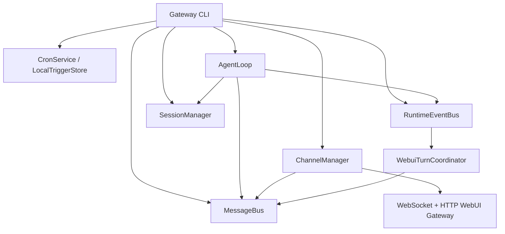

# nanobot 智能体引擎、运行持久化、上下文与服务层源码学习笔记

> 面向对象：准备阅读 Agent Framework 源码、参加 Python/AI Agent/后端架构面试的程序员。  
> 分析基线：当前工作区源码（2026-08-02）。本文只描述已经存在的实现，不把规划中的能力写成已完成事实。  
> 核心入口：`nanobot/agent/loop.py`、`nanobot/agent/runner.py`、`nanobot/session/manager.py`、`nanobot/agent/context.py`、`nanobot/agent/memory.py`、`nanobot/cli/gateway_runtime.py`。

---

## 1. 先给出整体结论

nanobot 的智能体引擎不是一个单体的“调用大模型函数”，而是由四层协作完成：

1. **接入与服务层**负责启动进程、管理 Channel、接收 HTTP/WebSocket/聊天平台消息。
2. **回合编排层 `AgentLoop`**负责会话、并发、上下文构建、阶段编排、持久化和投递。
3. **推理执行层 `AgentRunner`**负责真正的 `LLM -> tool -> LLM` 多轮循环。
4. **状态与上下文层**负责 Session JSONL、运行中 checkpoint、Provider 私有续传状态、上下文压缩与长期记忆。

最重要的调用链是：

```text
Channel / HTTP API
        │
        ▼
   InboundMessage
        │
        ▼
    MessageBus
        │
        ▼
 AgentLoop（回合生命周期、会话、并发、持久化）
        │
        ▼
 AgentRunner（LLM/工具迭代）
      ┌─┴───────────┐
      ▼             ▼
 LLMProvider    ToolRegistry
      └──────┬──────┘
             ▼
      Session / Checkpoint
             │
             ▼
 OutboundMessage -> MessageBus -> Channel
```

一句适合面试的概括：

> nanobot 采用“transport 与 agent core 解耦、回合编排与推理循环分离、模型请求上下文与持久化事实分离”的架构。`AgentLoop` 管产品语义，`AgentRunner` 管工具型推理循环，Session/Memory 管可恢复状态，Channel/API 只是适配边界。

---

## 2. 为什么要把 `AgentLoop` 和 `AgentRunner` 分开

### 2.1 `AgentLoop` 的职责

`AgentLoop` 是产品级回合编排器，而不是纯推理算法。它负责：

- 从 `MessageBus` 消费 `InboundMessage`；
- 根据 channel/chat 计算 session key；
- 保证同一 Session 串行、不同 Session 并行；
- 恢复上次中断的 checkpoint；
- 做会话压缩与历史回放；
- 拼装 system prompt、历史、当前输入和运行时上下文；
- 选择本回合不可变的 `LLMRuntime`；
- 把工具循环委托给 `AgentRunner`；
- 保存消息、Provider 状态、耗时和运行事件；
- 把最终响应投递回 Channel。

源码依据：`nanobot/agent/loop.py:181-191`、`1123-1223`、`1228-1340`、`1484-1492`。

### 2.2 `AgentRunner` 的职责

`AgentRunner` 刻意不关心 WebUI、Channel、Session 文件名等产品层概念。它只接受一个 `AgentRunSpec`，执行：

```text
准备模型消息
  -> 请求模型
  -> 若返回 tool_calls，则执行工具并追加 tool result
  -> 再请求模型
  -> 直到得到最终文本、错误、等待用户或达到迭代上限
```

`AgentRunSpec` 把一次执行所需依赖显式传入，包括 runtime、工具注册表、最大迭代次数、checkpoint callback、注入 callback、超时、goal/waiting predicate 和 Provider 状态。这样 Runner 可以被主智能体和子智能体复用，也更容易单测。

源码依据：`nanobot/agent/runner.py:90-135`、`138-142`、`372-420`。

### 2.3 这种分层的价值

- **可测试性**：Runner 可以用假 Provider、假 ToolRegistry 单独测试。
- **可复用性**：同一个工具循环可用于主 Agent、子 Agent、Dream 等场景。
- **隔离变化**：WebSocket 协议变化不必进入工具循环；模型重试规则也不必污染 Channel。
- **减少核心耦合**：项目设计约束明确要求核心保持小，能力优先扩展在 channel、tool、skill、MCP 边缘。

如果把所有逻辑放在一个 `Agent` 类中，最先出现的问题通常是：Channel 分支、持久化分支、流式回调、工具循环和重试策略交叉嵌套，最终无法独立测试，也无法安全复用。

---

## 3. 一次用户回合如何完整运行

### 3.1 回合状态载体：`TurnContext`

`TurnContext` 是一次回合的可变工作区，保存：

- 输入：`msg`、`session_key`、`turn_id`、`kind`；
- 已恢复状态：`session`、`history`、`provider_state`；
- 请求状态：`runtime`、`request_context`、`runtime_context_blocks`；
- 执行结果：`final_content`、`all_messages`、`stop_reason`；
- 投递状态：stream callbacks、`outbound`、是否抑制普通回复；
- 持久化边界：`input_persisted_early`、`save_skip`；
- 并发注入：`pending_queue`；
- 生命周期指标：起始时间、可见运行时间、latency。

它避免了十几个阶段之间传递超长参数列表，也把“本回合临时状态”与“Session 持久状态”区分开。

源码依据：`nanobot/agent/loop.py:118-178`。

### 3.2 七阶段回合流水线

`_process_message()` 将回合显式拆成七个阶段：


对应代码为：

```python
await restore
await compact
if await command:
    return
await build
await run
await save
await respond
```

源码依据：`nanobot/agent/loop.py:1484-1492`。

各阶段的语义如下。

#### RESTORE

- 将非图片附件改写成文本引用；
- 取得 Session；
- 发布 turn started；
- 持久化工作区 scope；
- 把上次中断的 runtime checkpoint 物化到会话历史；
- 如果上次只保存了用户消息却没生成回复，则补一条中断错误消息。

源码依据：`nanobot/agent/loop.py:1555-1590`、`2078-2195`。

#### COMPACT

- 检查 Session 是否刚做完空闲压缩；
- 取出持久化在 metadata 中的 `_last_summary`；
- 在后续 system prompt 中注入 archived summary。

源码依据：`nanobot/agent/loop.py:1592-1598`、`nanobot/agent/autocompact.py:124-143`。

#### COMMAND

- Slash command 可绕过普通 LLM 执行；
- 命令结果仍要写入 Session，保证 WebUI 随后通过历史接口能读到；
- `_command` 标记使这些消息可展示但不会污染下一次 LLM 上下文。

源码依据：`nanobot/agent/loop.py:1600-1647`、`nanobot/session/manager.py:225-228`。

#### BUILD

- 为当前 Session 解析一次不可变 runtime；
- 按上下文窗口计算最大回放消息数；
- 必要时先做 token consolidation；
- 从 Session 取合法历史；
- 恢复/校验 Provider 私有 conversation state；
- 解析 MCP、CLI app、Goal 等 runtime context provider；
- **在调用模型前先保存用户输入**；
- 构造最终 `initial_messages`。

源码依据：`nanobot/agent/loop.py:1649-1772`。

#### RUN

- 发布 running 状态；
- 组装 `AgentRunSpec`；
- 调用 `AgentRunner.run()`；
- 接收 final content、全量本回合消息、stop reason；
- 如果工具要求用户输入，则暂停并抑制普通终局回复。

源码依据：`nanobot/agent/loop.py:1774-1811`。

#### SAVE

- 只保存 `save_skip` 之后的新消息，避免重复写入历史；
- 校验 tool call/result 配对；
- 截断过大的工具结果；
- 保存 latency；
- 清理 pending user 和 runtime checkpoint；
- 调度后台 consolidation；
- 发布 session persisted 事件。

源码依据：`nanobot/agent/loop.py:1813-1862`、`1926-2020`。

#### RESPOND

- 系统回合与用户回合使用不同投递路径；
- 已经由 `message` 工具主动发送时，可以抑制重复最终消息；
- 流式成功时用 `StreamedResponseEvent` 告诉 Channel 不要再重复发送全文。

源码依据：`nanobot/agent/loop.py:1521-1553`、`1864-1885`。

---

## 4. `AgentRunner` 内部的工具型推理循环

### 4.1 基本状态机

Runner 每轮先调用 `ContextGovernor.prepare_for_model()`，再让 Provider 发起模型请求。模型响应分四类：

1. **tool call**：写入 assistant tool-call 消息，保存 checkpoint，执行工具，写入 tool result，再继续下一轮；
2. **正常最终文本**：保存 final-response checkpoint 后结束；
3. **错误/空响应/内容截断**：进入对应恢复策略；
4. **达到最大迭代数**：尝试一次禁用工具的 finalization，再使用兜底消息。

可近似写为：

```python
for iteration in range(max_iterations):
    model_messages = context_governor.prepare_for_model(transcript)
    response = await provider(...)

    if response.should_execute_tools:
        transcript.append(assistant_tool_calls)
        checkpoint("awaiting_tools")
        results = await execute_tools()
        transcript.extend(results)
        checkpoint("tools_completed")
        continue

    if response.finish_reason == "length":
        append_partial_and_request_continuation()
        continue

    if injected_input_arrived():
        append_injection()
        continue

    checkpoint("final_response")
    break
else:
    finalize_without_tools()
```

源码依据：`nanobot/agent/runner.py:420-483`、`511-634`、`686-763`、`805-883`。

### 4.2 为什么工具调用必须保存成 assistant + tool 成对消息

OpenAI 风格消息协议要求：assistant 消息先声明 `tool_calls[id]`，之后 tool 消息通过 `tool_call_id` 回填结果。如果出现：

- tool result 没有对应声明；
- 一个 id 被重复回填；
- assistant 声明了调用但没有结果；
- tool name 为空；

上游 Provider 可能直接拒绝整个历史。nanobot 在两个边界防御：

- **持久化时**丢弃孤儿/重复结果；
- **发给模型前**丢弃 malformed/orphan，并为缺失结果补中断占位符。

这是一种“持久化事实尽量保真，模型请求副本允许自愈”的策略。

源码依据：`nanobot/agent/loop.py:1937-2017`、`nanobot/agent/context_governance.py:178-306`。

### 4.3 工具并发不是无条件 `gather`

只有同时满足：

- `spec.concurrent_tools` 开启；
- Tool 自己声明 `concurrency_safe`；

工具才会进入同一个并发 batch。非并发安全工具会切断 batch 并串行执行。这避免两个文件写工具、状态修改工具或交互工具同时运行造成竞态。

源码依据：`nanobot/agent/runner.py:1370-1435`、`1674-1697`。

### 4.4 错误策略

- 普通工具错误默认作为 tool result 返回给模型，使模型能换方法；
- `fail_on_tool_error` 可把工具错误升级为回合级 fatal error；
- SSRF、工作区越界属于不可绕过的安全边界，但会转成清晰的模型反馈，阻止模型反复换工具绕过；
- 空模型响应会有限次数重试；
- `finish_reason=length` 会把已生成片段保存并请求续写；
- 达到 `max_iterations` 后，禁用工具请求一次最终总结，防止用户只看到“迭代耗尽”。

源码依据：`nanobot/agent/runner.py:643-711`、`765-803`、`839-883`、`1437-1565`。

---

## 5. 并发模型：同 Session 串行、跨 Session 并行

### 5.1 为什么必须按 Session 加锁

两个请求如果同时修改同一会话，会造成：

- 两个请求都从相同历史开始，产生分叉；
- tool call/result 顺序交错；
- 后写者覆盖前写者的 JSONL；
- Provider continuation state 与消息历史不再对应。

因此 `AgentLoop` 为每个 `session_key` 建一个 `asyncio.Lock`：

- 同一 Session：串行；
- 不同 Session：由不同 asyncio task 并行；
- WeakValueDictionary 允许闲置锁被回收。

API 层也有自己的 per-session lock，用来保护同一个 API `session_id` 的直接调用；`process_direct()` 最终仍会共享 AgentLoop 的 Session 锁。

源码依据：`nanobot/agent/loop.py:1228-1243`、`2229-2268`、`nanobot/api/server.py:308-315`。

### 5.2 用户在执行中继续发消息怎么办

当某个 Session 已在运行时，新消息不是立刻开启竞争回合，而是进入该 Session 的 `pending_queue`：

- Runner 在工具执行后、最终回复后、错误后等安全点 drain；
- 注入消息被追加为新的 user 消息；
- Runner 带着最新输入继续推理；
- 每回合有注入次数上限，避免无限延长；
- 未消费的消息在 dispatch `finally` 中重新发布到 MessageBus，避免丢失。

这比“每条消息都创建新任务”更符合对话语义，也比随时中断当前 LLM 调用更容易保持 transcript 合法。

源码依据：`nanobot/agent/loop.py:1187-1217`、`1237-1243`、`1310-1333`、`nanobot/agent/runner.py:241-370`。

---

## 6. “持久化运行流程”究竟持久化了什么

这个问题必须拆成五种不同状态。把它们混称为“记忆”会失去工程精度。

### 6.1 进程级持久化：Gateway 是否在运行

`ManagedProcessRuntime` 管理后台进程：

- detached child process；
- state JSON 保存 pid、process identity、启动时间、端口、workspace、config、command、log path；
- 生命周期操作由 file lock 串行化；
- status 会同时检查 pid 与 process identity，避免 PID 被复用后误杀无关进程；
- state 文件使用临时文件 + fsync + rename 原子替换；
- systemd/launchd 可进一步提供 OS 级守护和失败重启。

源码依据：`nanobot/process_runtime.py:69-189`、`350-393`、`nanobot/gateway/runtime.py:27-104`、`nanobot/gateway/service.py:44-199`。

注意：进程 state 只回答“哪个 Gateway 进程在跑”，不包含智能体推理栈。

### 6.2 会话级持久化：完整可展示 transcript

每个 Session 保存为工作区 `sessions/<base64url(session_key)>.jsonl`：

```json
{"_type":"metadata", "metadata":{}, "last_consolidated":0, ...}
{"_type":"provider_state", "state":{...}}
{"role":"user", "content":"...", "timestamp":"..."}
{"role":"assistant", "tool_calls":[...]}
{"role":"tool", "tool_call_id":"...", "content":"..."}
```

为什么用 base64url key，而不是简单把 `:` 换成 `_`：后者会碰撞，前者可逆且稳定。

为什么用 JSONL：

- 人工可读，调试容易；
- 消息天然是一行一条记录；
- 单行损坏时 repair 可以跳过坏行，保留其他记录；
- 项目规模小，不必引入数据库部署成本。

保存仍采用“完整重写临时文件 -> `os.replace`”，而不是直接 append Session 文件。原因是 metadata、Provider state、裁剪边界都可能变化，完整快照更容易保证一致性。正常关机还会 `flush_all(fsync=True)`。

源码依据：`nanobot/session/manager.py:486-600`、`602-735`、`957-1099`、`nanobot/cli/gateway_runtime.py:819-824`。

### 6.3 回合级持久化：运行中 checkpoint

这是回答“崩溃后怎么恢复”的核心。

Runner 在三个位置提交 checkpoint：

| phase | 保存内容 | 恢复含义 |
|---|---|---|
| `awaiting_tools` | assistant tool calls、尚未执行的调用 | 重启后把未完成调用补成 interrupted tool result |
| `tools_completed` | assistant tool calls、已完成结果、Provider state | 已完成工具结果不会丢失 |
| `final_response` | 最终 assistant message、Provider state | 最终回复可物化进历史 |

`AgentLoop._checkpoint()` 将 Provider 私有状态单独写入 `session.provider_state`，公开 checkpoint 放到 `session.metadata["runtime_checkpoint"]`，然后立即保存 Session。

恢复时会：

- 把 checkpoint 中 assistant/tool 消息追加到正式 transcript；
- 对 pending tool call 写入 `Error: Task interrupted before this tool finished.`；
- 用尾部 overlap 比较去重，保证恢复幂等；
- 只有 Provider state 与 checkpoint phase 精确同步时才保留，否则清空；
- 清理 checkpoint 和 pending 标志。

源码依据：`nanobot/agent/loop.py:878-892`、`2051-2174`、`nanobot/agent/runner.py:527-537`、`599-613`、`816-827`。

#### 恢复能力的准确边界

nanobot **不是** Durable Execution Engine：

- 不会从某条 Python 指令继续；
- 不会自动重新执行“正在运行时崩溃”的工具；
- 不保证外部副作用 exactly-once；
- 不保存 asyncio task 或调用栈。

它恢复的是**对话协议上的一致状态**：已完成结果保留，未完成调用明确标记为中断，下一个用户回合可以基于此继续。这种设计避免盲目重放有副作用的工具。

如果面试官问“为什么不自动重试未完成工具”，推荐回答：

> 因为工具可能已经完成外部副作用，只是进程在记录结果前崩溃。自动重试会造成重复发邮件、重复扣款或重复写文件。除非每个工具具备幂等键、事务日志和可查询的提交状态，否则标记 interrupted 并让上层重新决策更安全。

### 6.4 Provider 私有 conversation state

部分 Provider（例如 Responses 类协议）能用自己的 response id、加密 reasoning item 等状态继续会话。nanobot 用 `ProviderConversationState` 保存：

- provider、model、kind、version；
- opaque payload；
- 自上次 Provider 边界后的 pending Chat-style messages。

它作为 JSONL 中的私有记录保存，不进入公开历史和普通日志。恢复前必须由 Provider 的 `can_resume_conversation_state()` 校验 provider/model 是否兼容。模型切换、压缩历史或状态不精确同步时会清空它，退回完整 Chat transcript。

源码依据：`nanobot/providers/base.py:156-238`、`nanobot/providers/conversation_state.py:30-204`。

这解决的是“利用 Provider 原生续传能力”，不是 Session 历史的替代品。Session transcript 仍是跨 Provider 的可移植事实来源。

### 6.5 目标/交互等业务运行状态

持续目标写在 Session metadata 的 `goal_state` 中，包含 objective、status、started/ended time、recap 等；工具每次变更后立即保存并发布 runtime event。下一回合通过 runtime context 再注入目标。

因此进程重启后“目标仍然存在”，但它不代表后台一定有一个 task 在无人值守地持续运行。持续推进依靠当前回合 continuation、cron/local trigger 或未来再次唤醒。

源码依据：`nanobot/session/goal_state.py:23-115`、`nanobot/agent/tools/long_task.py:52-112`、`194-235`、`300-360`。

---

## 7. 上下文是如何构建与控制的

### 7.1 必须区分四个概念

| 概念 | 作用 | 是否持久化 |
|---|---|---|
| Session transcript | 对话事实和工具链记录 | 是，Session JSONL |
| System prompt | 身份、项目规则、技能、记忆、摘要 | 每次动态重建 |
| Runtime context | Goal、CLI app、MCP preset、引用上下文等当前回合附加信息 | 可在消息 metadata 留 marker |
| Provider state | Provider 私有续传数据 | 是，私有 JSONL record |

### 7.2 System prompt 的组成顺序

`ContextBuilder.build_system_prompt()` 按顺序拼接：

1. identity 与平台/工作区信息；
2. `AGENTS.md`、`SOUL.md`、`USER.md`；
3. tool contract；
4. `MEMORY.md` 长期记忆；
5. 本回合显式激活和 always-on skills；
6. 其他技能摘要；
7. 尚未被 Dream 消化的 Recent History；
8. Session archived summary。

各段用分隔线连接。默认模板内容可跳过，避免无意义 token；显式触发技能只在需要时加载全文。

源码依据：`nanobot/agent/context.py:54-127`、`169-204`。

### 7.3 历史回放不是简单 `messages[-N:]`

`Session.get_history()` 做了多层约束：

- 只取 `last_consolidated` 之后的未压缩尾部；
- 先按消息数限制，再按 token budget 从尾部裁剪；
- 尽量从 user 消息边界开始；
- 丢弃开头孤立的 tool result；
- 过滤 slash command；
- 清理 assistant 中会污染模型模仿的内部痕迹；
- 图片不能重新发送原二进制时，合成 `[image: path]` breadcrumb；
- 保留 tool_calls、tool_call_id、reasoning 等协议字段；
- token 很紧时也尽量恢复最近一个 user turn，避免 assistant-only 尾巴。

源码依据：`nanobot/session/manager.py:188-316`。

这体现一个关键原则：**上下文裁剪必须保持对话协议合法，而不仅是长度合法。**

### 7.4 两级 token 防线

nanobot 有两套互补的上下文控制。

#### Session 级 consolidation

在回合构建前估算完整 prompt（包括 system、summary、tools）：

```text
input budget = context window - max output tokens - safety buffer
target = input budget × consolidation_ratio
```

如果超限，就按 user-turn 边界选取旧消息块，让 LLM 生成摘要并追加到 `history.jsonl`，推进 `last_consolidated`。摘要还写入 Session `_last_summary`，下一回合注入 system prompt。Provider 不可用时 raw archive，避免原文完全丢失。

源码依据：`nanobot/agent/memory.py:839-944`、`946-1047`、`1049-1157`。

#### Runner 级 model-copy governance

工具循环执行期间，新的工具结果可能让上下文突然爆炸。Runner 每轮对**发给模型的副本**做：

- malformed/orphan 修复；
- 大工具结果 offload/截断；
- 只压缩本回合中可压缩工具的结果；
- 保留 system messages；
- 从尾部保留合法 user-turn 历史。

它不直接改 Session transcript，因此展示历史与审计事实不被一次临时 token 裁剪破坏。

源码依据：`nanobot/agent/context_governance.py:73-108`、`308-435`。

### 7.5 为什么不用“永远只保留最近 20 条”

- 20 条短消息和 20 条巨大工具结果的 token 量完全不同；
- 可能从 tool result 中间开始，协议非法；
- 会丢掉长期任务的关键决策；
- 不考虑 system prompt 和工具 schema 的固定成本；
- 无法利用摘要保留旧信息。

nanobot 仍保留消息数上限作为硬边界，但主要决策基于 token 预算和合法回合边界。

### 7.6 长期记忆与 Session 历史的区别

- `sessions/*.jsonl`：某一会话的细粒度事实；
- `history.jsonl`：被压缩回合的摘要/原始归档，带单调 cursor；
- `MEMORY.md`：Dream 从历史中进一步整理出的长期稳定信息；
- dream cursor：标记已处理到哪个 history entry。

Recent History 只读取 Dream cursor 之后尚未消化的条目，避免长期记忆与近期摘要无限重复。`history.jsonl` 的原子重写使用 temp + fsync + rename；append 时 cursor 分配和写入由 lock 保护。

源码依据：`nanobot/agent/memory.py:278-442`、`510-544`、`582-700`。

---

## 8. 服务层是如何构建的

### 8.1 Gateway 是组合根（composition root）

`_run_gateway()` 是最重要的服务装配入口。它创建并连接：



这样依赖在启动边界显式创建，业务对象内部不需要到处读取全局 singleton。

源码依据：`nanobot/cli/gateway_runtime.py:204-350`、`354-359`、`573-588`。

### 8.2 MessageBus 为什么只是两个 `asyncio.Queue`

`MessageBus` 只有 inbound/outbound 两个内存队列。对于单进程轻量框架，这带来：

- Channel 与 Agent 解耦；
- 新 Channel 不需要修改 Agent core；
- 背压和异步等待语义清晰；
- 无 Kafka/RabbitMQ 的部署成本。

代价也必须说清：队列本身不持久化，进程崩溃时尚未进入 Session checkpoint 的队列消息可能丢失；它也不是多实例分布式总线。

源码依据：`nanobot/bus/queue.py:8-44`。

### 8.3 ChannelManager

`ChannelManager`：

- 通过 registry/插件发现可用 Channel；
- 只加载已启用 Channel 的可选依赖；
- 给每个 Channel 传同一个 MessageBus；
- 启动所有 Channel 和 outbound dispatcher；
- 根据 `msg.channel` 路由输出；
- 对 stream delta 做合并，减少下游 API 调用；
- 处理进度、reasoning、重试、最终消息等 typed event；
- 做有边界的重复响应抑制和发送重试。

源码依据：`nanobot/channels/manager.py:79-126`、`150-278`、`553-571`、`659-737`。

### 8.4 WebUI 为什么同时使用 HTTP 和 WebSocket

WebSocket Channel 内嵌了 HTTP handler：

- **HTTP**：bootstrap、session list、完整消息 hydration、设置、workspace、skills、media 等请求/响应型资源；
- **WebSocket**：new_chat、attach、message，以及 delta、reasoning、tool activity、turn_end、goal/plan state 等实时事件。

推荐理解为：

```text
HTTP = 获取完整快照与执行管理操作
WebSocket = 发送实时输入并接收增量事件
Session JSONL = 最终持久化事实
```

WebSocket 建连后先发 `ready`，客户端再 `attach` 某 chat；发送 `message` 时服务端校验权限、文本/附件大小、workspace scope，写 transcript，再发布 `InboundMessage`。`message_accepted` 只表示进入系统，不表示 Agent 已完成。

源码依据：`nanobot/webui/gateway_services.py:27-120`、`nanobot/webui/ws_http.py:158-304`、`341-475`、`nanobot/channels/websocket/runtime.py:572-627`、`635-677`、`762-935`。

为什么不只用 WebSocket：Session list、静态资源、文件预览和设置等天然适合 HTTP，HTTP 也更容易缓存、调试和重试。  
为什么不只用 HTTP polling：token delta、reasoning、工具进度和 turn 状态需要低延迟推送，轮询会产生延迟与大量空请求。

### 8.4.1 WebUI 中多个 `Work` 的真实含义：运行层级与事件层级

截图中的 `Work` 不是后端的 `Work` 对象，也不是一个新的 Agent、子 Agent 或独立 Runtime。它是 WebUI 对一段连续“推理/工具活动”的折叠展示块，主要由 [`webui/src/components/thread/AgentActivityCluster.tsx`](../webui/src/components/thread/AgentActivityCluster.tsx) 渲染。

#### 先区分四个层级

```text
Topic / Session
    └── 一次用户消息对应一个 Agent Run（turn_id）
          ├── ReAct iteration 1：LLM → Tool → Tool Result
          ├── 中间 assistant 状态说明
          ├── ReAct iteration 2：LLM → Search/Fetch → Tool Result
          └── 最终 assistant 回复
```

1. **Topic / Session**：左侧主题和会话持久化边界，保存 transcript、metadata 和恢复信息。
2. **Agent Run / Turn**：一次用户消息触发的完整处理过程，通常由一个 `turn_id` 标识，以 `turn_end` 结束。
3. **ReAct iteration**：模型决定下一步行动，调用一个或多个工具，读取结果后再次调用模型；这是 Runner 的执行概念，不是前端卡片。
4. **Work / Activity Cluster**：前端把相邻的 reasoning-only assistant 消息和 `kind = "trace"` 的工具进度合并后的视觉单元。

因此，多个 Work 通常表示**同一个 Agent Run 中连续的活动片段**，它们是顺序关系，不是父子关系，也不是 Work 之间互相调用：

```text
同一个 turn_id
  Work 1（读取文件）
  普通 assistant 状态说明
  Work 2（联网搜索）
  普通 assistant 状态说明
  Work 3（生成 ChangeSet）
  turn_end
```

如果用户再次发送消息，通常会产生新的 `turn_id`，那才是下一次 Agent Run。判断两个 Work 是否属于同一次运行，不能只看界面标题，应查看 `turn_id`；同一 Run 内再用 `turn_seq` 和 `turn_phase` 保证顺序。`activitySegmentId` 只负责把连续的前端活动行归入某个展示片段。

#### 前端为什么会把一次 Run 拆成多个 Work

`webui/src/lib/activity-timeline.ts` 将一个 turn 规范化为两类 `TurnUnit`：

```text
TurnUnit(type = "activity")  → reasoning-only / tool trace / file activity
TurnUnit(type = "message")   → 普通可见的 assistant 消息
```

当活动消息之间出现普通 assistant 消息时，前一个 activity cluster 被刷新；后续工具活动再形成新的 cluster。文件编辑活动与普通工具活动、不同 `activitySegmentId` 之间也可能被分开。故 `Work` 数量不等于 ReAct iteration 数量，也不等于工具调用数量；它是带有合并规则的 UI 投影。

#### 运行事件与 UI 类型的对应

WebSocket Runtime 在 [`nanobot/channels/websocket/runtime.py`](../nanobot/channels/websocket/runtime.py) 中把内部事件转换为 WebUI 可消费的消息：

| Runtime / Wire 事件 | UI 语义 | 是否属于 Work |
|---|---|---|
| `reasoning_delta` / `reasoning_end` | 推理片段 | 通常属于 activity |
| `ProgressEvent(tool_hint=True)` | 工具提示、搜索、读取、命令 | 属于 activity/trace |
| `ProgressEvent` | 一般进度 | 属于 activity/trace |
| 普通 `message` 或 `delta` 组装出的 assistant 内容 | 可见的 assistant 状态或回答 | 不属于 Work，本身是 message |
| `writing_artifact` | Writing Document Runtime 状态同步 | 不是 Work，属于领域状态事件 |
| `working_plan` | Working Plan 状态同步 | 不是 Work，属于计划状态事件 |
| `turn_end` | 本轮结束边界 | 结束 Agent Run，不是 Work |

#### 示例：`ch02 内容已完整读取……` 属于什么

```text
ch02 内容已完整读取。现在创建 ch02 章节，并联网核实松花湖扩写所需的新事实。
```

这句话是普通的 assistant 阶段状态说明，不是 `tool_start`、`tool_result`、`reasoning_delta` 或 `writing_artifact`。如果通过流式协议发送，线上可能先出现若干 `delta`，但在 WebUI 的规范化模型里它属于：

```text
role = "assistant"
kind != "trace"
turn_phase = "answer"
turn_id = 当前 Agent Run 的 turn_id
```

它的作用是向用户解释阶段切换：前一个 Work 已完成文件读取，下一段 Work 将执行联网搜索。因此截图中通常表现为：

```text
Work 1：Read file
    ↓
assistant 状态说明：ch02 已完整读取……
    ↓
Work 2：Search / Fetch
```

字体较大是因为它被渲染为普通 assistant message；搜索行是 `trace/activity`。这表示展示类型不同，不表示 Agent 等级不同。

#### 面试回答方式

可以这样回答：

> nanobot 的一个 Agent Run 由 `turn_id` 标识，内部可以包含多次 ReAct 迭代。WebUI 的 `Work` 不是持久化工作流节点，而是把相邻的 reasoning 和 tool trace 合并成一个 Activity Cluster。普通 assistant 阶段说明会结束前一个 Cluster，并让后续工具活动形成新的 Cluster。判断多个 Work 是否属于同一次运行，应看 `turn_id` 和 `turn_end`，而不能把界面上的 Work 数量直接当成 ReAct 次数。

### 8.5 OpenAI-compatible API 是另一条薄适配路径

`nanobot serve` 创建独立 aiohttp app：

- `/v1/chat/completions`；
- `/v1/models`；
- `/health`；
- Bearer token middleware；
- JSON/multipart 输入；
- SSE 流式输出；
- 最终调用同一个 `AgentLoop.process_direct()`。

因此 API 没有复制智能体逻辑，只负责协议转换、认证、超时和流式封装。

源码依据：`nanobot/cli/commands.py:317-395`、`nanobot/api/server.py:268-419`、`450-492`。

### 8.6 启动与关闭顺序

Gateway 启动时并发运行：

- config watcher；
- `agent.run()`；
- `channels.start_all()`；
- local trigger queue；
- health server；
- 可选 browser opener。

关闭时：

1. 停止 cron 与 Agent admission；
2. 先关 Channel transport，防止 SDK 重连吞取消；
3. cancel 并等待所有 runtime task；
4. `flush_all(fsync=True)` 持久化 Session；
5. 恢复 signal handler。

源码依据：`nanobot/cli/gateway_runtime.py:733-826`。

---

## 9. 关键设计权衡：为什么这样设计，而不用其他方案

### 9.1 为什么不用 LangGraph/通用工作流 DAG

当前核心问题是开放式工具调用循环，不是预定义节点编排。一个小 `for iteration` 循环更直接：

- 模型可动态决定下一工具；
- 调试 transcript 即可理解运行；
- 没有图状态序列化和 node abstraction 成本；
- 适合轻量项目定位。

什么时候应该引入图/DAG：

- 流程节点固定且需要业务审计；
- 分支、补偿、人工审批有明确状态机；
- 每个节点都要独立重试、超时、恢复；
- 需要可视化编排和跨 worker 调度。

### 9.2 为什么不用数据库保存 Session

JSONL 对单机轻量框架足够简单、透明、易迁移，repair 还能跳过坏行。但它不适合：

- 多进程/多实例并发写同一 Session；
- 大规模索引和条件查询；
- 事务性跨 Session 更新；
- 高吞吐追加；
- 权限隔离和租户统计。

如果产品走向多租户服务，合理演进是保留 `SessionStore` Protocol，将 JSONL 实现替换为 PostgreSQL/SQLite，而不是让 `AgentLoop` 直接写 SQL。当前代码已经有 `SessionStore` 抽象，为这一演进留了边界。

源码依据：`nanobot/session/manager.py:472-486`。

### 9.3 为什么持久 transcript 和 model-facing copy 分开

持久 transcript 服务于审计、UI 和恢复；model-facing copy 服务于协议兼容和 token 预算。若直接在原历史上裁剪：

- UI 会莫名丢消息；
- 崩溃恢复证据丢失；
- 一次 Provider 的限制会永久改变跨 Provider 历史；
- 工具结果 offload placeholder 会污染真实记录。

因此 `ContextGovernor` 返回副本/变换结果，并明确不原地修改 Session 历史。

### 9.4 为什么用户消息要在模型调用前保存

如果进程在 LLM 调用中崩溃，而用户消息尚未保存，重启后用户会看到输入完全消失。提前保存并设置 `pending_user_turn` 后，即使没有任何模型结果，恢复也能补一条“响应生成前中断”的 assistant 记录。

代价是需要 `save_skip` 和 pending 标志避免最终保存时重复。这个复杂度换来了更好的故障可解释性。

### 9.5 为什么 Runtime 要在回合 admission 时冻结

配置 watcher 可以在运行中刷新模型配置。如果一个回合中途 provider/model/context window 改变，Provider state、token budget 和工具调用协议可能不一致。因此每回合取得一个不可变 `LLMRuntime` 快照，配置变化只影响后续 admission。

源码依据：`nanobot/agent/loop.py:229-245`、`318-340`。

### 9.6 为什么 RuntimeEventBus 与 MessageBus 分开

- MessageBus 传用户/Channel 可投递消息；
- RuntimeEventBus 传 turn started、run status、persisted、goal changed 等内部 typed lifecycle event。

若混在同一个字符串事件流中，Agent core 会知道 WebUI `_turn_end` 等 wire 细节。现在 `WebuiTurnCoordinator` 订阅通用 runtime event，再转换为 WebUI 所需输出，保持 core 与前端协议分离。

---

## 10. 架构优点、限制与可演进方向

### 10.1 优点

- 核心工具循环可复用、可测试；
- Channel/Provider/Tool/Skill 都是边缘扩展点；
- 同 Session 串行保证一致性，跨 Session 保持并发；
- 有真实的中断 checkpoint，而不仅是最终聊天记录；
- transcript、Provider state、长期记忆边界清楚；
- 上下文控制兼顾 token、协议合法性和审计事实；
- Gateway/API 都复用同一个 AgentLoop；
- 原子文件写、repair、fsync shutdown 提升单机可靠性。

### 10.2 限制

- MessageBus 是进程内队列，不支持分布式消费和消息持久化；
- JSONL store 不适合多实例同时写；
- checkpoint 是对话级恢复，不是 exactly-once durable workflow；
- 工具外部副作用没有统一事务/idempotency contract；
- Context token 估算仍可能与 Provider 真正 tokenizer 有偏差，所以需要 safety buffer；
- LLM 摘要可能遗漏信息，raw archive 只能兜底可追溯性，不能保证自动召回；
- Gateway OS service installer 当前主要覆盖 systemd/launchd，Windows 依靠后台进程 runtime，而非同等的 Windows Service 安装器。

### 10.3 如果要演进成生产级多租户服务

建议按边界演进，而不是重写 AgentRunner：

1. `SessionStore` 换成带版本号/乐观锁的数据库实现；
2. MessageBus 换成可持久消息系统，并给 inbound event 唯一 id；
3. 工具引入 idempotency key、effect journal 和 side-effect status query；
4. checkpoint 增加 turn version/CAS，防止多 worker 竞争；
5. media/tool result offload 到对象存储；
6. runtime event 写入 observability pipeline；
7. 对明确业务流程另建 durable workflow 层，保留 Runner 作为其中的“开放式 Agent 节点”。

---

## 11. 面试官可能问的问题与推荐回答

### Q1：请用一分钟介绍 nanobot 的智能体架构。

推荐回答：

> 接入层把不同 Channel 的输入统一成 `InboundMessage` 放入进程内 MessageBus。`AgentLoop` 以 Session 为一致性边界，完成恢复、压缩、上下文构建、runtime 选择、保存和响应投递；`AgentRunner` 只负责 LLM 与工具的迭代循环。Session JSONL 保存 transcript、metadata 和 Provider 私有状态，运行中通过 checkpoint 保留已完成工具结果。WebUI 用 HTTP 获取快照、WebSocket 接收增量事件，OpenAI-compatible API 则通过 `process_direct()` 复用同一核心。

### Q2：`AgentLoop` 与 `AgentRunner` 的区别是什么？

推荐回答：

> Loop 是产品级 orchestration，关心 Session、Channel、持久化和回合阶段；Runner 是纯 execution engine，关心模型请求、工具执行、重试和停止条件。分开后同一个 Runner 可用于主 Agent、子 Agent 或内部任务，协议适配也不会侵入工具循环。

### Q3：它如何保证同一会话消息不乱序？

推荐回答：

> 每个 session key 有共享 asyncio lock，同一 Session 串行，不同 Session 创建独立 task 并行。运行中到达的同 Session 消息进入 pending injection queue，在 Runner 的安全点合并；未消费消息会重新发布，不静默丢弃。

### Q4：崩溃后能恢复到工具执行的哪一步？

推荐回答：

> Runner 在 awaiting-tools、tools-completed、final-response 三个协议阶段持久化 checkpoint。已完成工具结果可以恢复；未完成工具不会盲目重跑，而是补 interrupted result。它恢复的是合法 transcript 和 Provider continuation state，不是 Python 调用栈，也不承诺 exactly-once 副作用。

### Q5：为什么不自动重放未完成工具？

推荐回答：

> 因为无法判断外部副作用是否已经发生。没有 idempotency key、事务日志和状态查询时，重放可能造成重复操作。当前选择显式标记中断，由下一轮模型或用户决定是否安全重试。

### Q6：Session 为什么用 JSONL，可靠性如何？

推荐回答：

> JSONL 符合轻量单机框架定位，可读、易迁移、单行可修复。Session save 使用临时文件完整写入后原子 replace，可选 fsync；加载失败会逐行 repair；退出时对缓存 Session 做 fsync flush。缺点是多实例写和复杂查询能力弱，未来可通过 `SessionStore` Protocol 换数据库。

### Q7：上下文超限怎么处理？

推荐回答：

> 有两级防线。回合前按完整 prompt token 预算把旧 user-turn 块总结到 history，并推进 last_consolidated；工具循环中再对 model-facing copy 修复协议、offload 大结果、压缩本回合工具输出并裁剪合法尾部。真实 transcript 不因临时裁剪被破坏。

### Q8：长期记忆和会话历史有什么区别？

推荐回答：

> Session 是单会话的详细事实；history.jsonl 是压缩出的摘要或 raw archive；MEMORY.md 是 Dream 从历史中提炼的长期信息。dream cursor 防止同一批 history 反复注入和处理。

### Q9：为什么还要保存 Provider state，直接回放 messages 不行吗？

推荐回答：

> messages 是跨 Provider 的兼容事实，但有些 Provider 的原生 continuation 包含 response id、加密 reasoning 等 Chat 消息无法表达的信息。保存 Provider state 可以高效且完整地续传；一旦 provider/model 不兼容或历史被压缩，就清空状态并退回 messages 回放。

### Q10：为什么 WebUI 同时需要 HTTP 和 WebSocket？

推荐回答：

> HTTP 适合 bootstrap、Session 快照、设置和文件等资源操作；WebSocket 适合 token delta、reasoning、tool activity、turn state 等实时推送。最终事实仍落在 Session store，客户端断线后可用 HTTP 重新 hydrate。

### Q11：为什么 MessageBus 不直接上 Kafka？

推荐回答：

> 当前是单进程轻量框架，两个 asyncio Queue 已能解除 Channel 与 Agent 的编译时耦合，运维成本最低。Kafka 只有在多实例、持久消费、跨服务回放和高吞吐成为真实需求时才值得引入；届时还要同时解决 Session 并发写和幂等性，不能只替换队列。

### Q12：项目里最值得肯定的可靠性设计是什么？

推荐回答：

> 我会选三点：用户输入先于模型调用持久化；工具协议阶段 checkpoint 并做幂等恢复；持久 transcript 与模型请求副本分离。这三点共同保证崩溃可解释、历史可审计、上下文可自愈。

### Q13：你认为最大的技术债是什么？

推荐回答：

> 不是代码行数本身，而是单机持久化和开放式工具副作用之间的可靠性边界。当前 checkpoint 能恢复对话，但不能提供 exactly-once。如果要生产多租户化，需要数据库版本控制、持久消息、工具幂等协议和 effect journal。回答时要先肯定当前定位合理，再说明规模变化后的演进路径。

### Q14：为什么不把所有 runtime event 直接写成 WebSocket JSON？

推荐回答：

> 那会让 Agent core 依赖前端 wire protocol。当前先发布 typed runtime event，再由 WebUI coordinator/channel 转换为 `_turn_end`、goal sync 等具体事件，使 Telegram、API 和 WebUI 能共享核心生命周期而各自决定展示方式。

### Q15：如何测试这个引擎？

推荐回答：

> 分层测试。Runner 用 fake provider/tool 覆盖 tool loop、重试、max iteration、checkpoint；SessionStore 覆盖原子保存、repair、合法历史裁剪；AgentLoop 覆盖阶段顺序、per-session serialization、injection 和 crash restore；API/WebSocket 做协议适配测试；最后做 Gateway 启停和真实 Provider smoke test。关键断言不是只有最终文本，还包括 transcript 结构、checkpoint 清理、tool-call 配对和事件顺序。

---

## 12. 推荐源码阅读顺序

### 第一轮：先建立主流程

1. `nanobot/bus/events.py`
2. `nanobot/bus/queue.py`
3. `nanobot/agent/loop.py` 中 `TurnContext`、`run()`、`_dispatch()`、`_process_message()`
4. `nanobot/agent/runner.py` 中 `AgentRunSpec`、`run()`、`_run_core()`
5. `nanobot/agent/tools/registry.py`
6. `nanobot/providers/base.py`

目标：可以手画 `Channel -> Bus -> Loop -> Runner -> Provider/Tool -> Bus`。

### 第二轮：学习状态与可靠性

1. `nanobot/session/manager.py`
2. `nanobot/agent/loop.py` 的 `_persist_user_message_early()`、`_save_turn()`、checkpoint restore
3. `nanobot/providers/conversation_state.py`
4. `nanobot/process_runtime.py`
5. `nanobot/session/goal_state.py`

目标：能准确说明“哪些状态能恢复、哪些不能恢复”。

### 第三轮：学习上下文工程

1. `nanobot/agent/context.py`
2. `nanobot/agent/context_governance.py`
3. `nanobot/agent/memory.py`
4. `nanobot/agent/autocompact.py`
5. `nanobot/runtime_context.py`

目标：能解释 prompt 组成、token 预算、摘要、长期记忆和 Provider state 的区别。

### 第四轮：学习服务化

1. `nanobot/cli/gateway_runtime.py`
2. `nanobot/channels/manager.py`
3. `nanobot/channels/websocket/runtime.py`
4. `nanobot/webui/gateway_services.py`
5. `nanobot/webui/ws_http.py`
6. `nanobot/api/server.py`

目标：能解释 Gateway 的 composition root、HTTP/WS 分工、启动关闭顺序和并发边界。

---

## 13. 建议自己动手完成的学习练习

这些练习只需写测试或画图，不必修改生产逻辑：

1. 用 FakeProvider 模拟“两次 tool call 后最终回复”，打印完整 messages。
2. 在 `awaiting_tools` checkpoint 后模拟进程崩溃，验证下次恢复出现 interrupted tool result。
3. 构造孤儿 tool result，观察 `ContextGovernor` 如何清理。
4. 构造 3 个不同 session key 并发请求，再构造 3 个相同 key 请求，对比运行顺序。
5. 构造巨大 `read_file` 结果，观察 offload、micro-compaction 和最终持久 transcript 的差异。
6. 切换 Provider/model，验证不兼容的 Provider conversation state 被清空。
7. 断开 WebSocket 后通过 Session HTTP 接口重新 hydrate，验证增量事件不是唯一事实源。
8. 人工损坏 Session JSONL 中一行，验证 repair 保留其他合法记录。

---

## 14. 最后形成自己的面试叙事

不要只背类名。建议按下面四句话组织回答：

1. **架构**：接入层、回合编排层、推理执行层、状态上下文层如何分工。
2. **主链**：一条消息如何从 Channel 到 LLM/Tool 再回到用户。
3. **可靠性**：同 Session 串行、用户输入早保存、三阶段 checkpoint、原子 JSONL。
4. **权衡**：它是轻量单机 Agent Framework，不是分布式 durable workflow；规模扩大时沿现有 Store/Bus/Tool 边界演进。

能同时讲清“它做到了什么”和“它没有承诺什么”，通常比只罗列功能更能体现工程判断。
