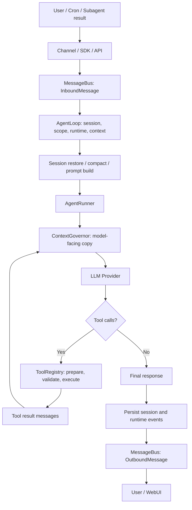
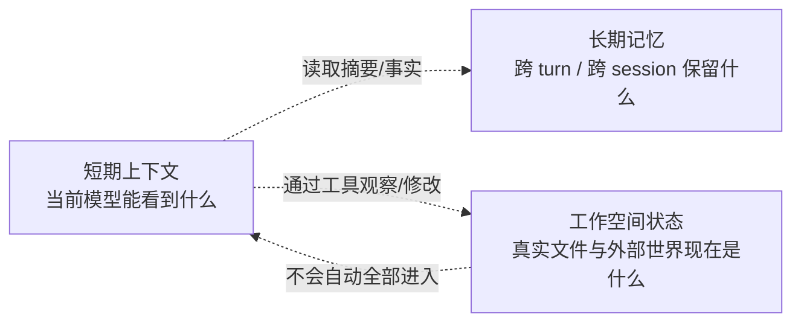
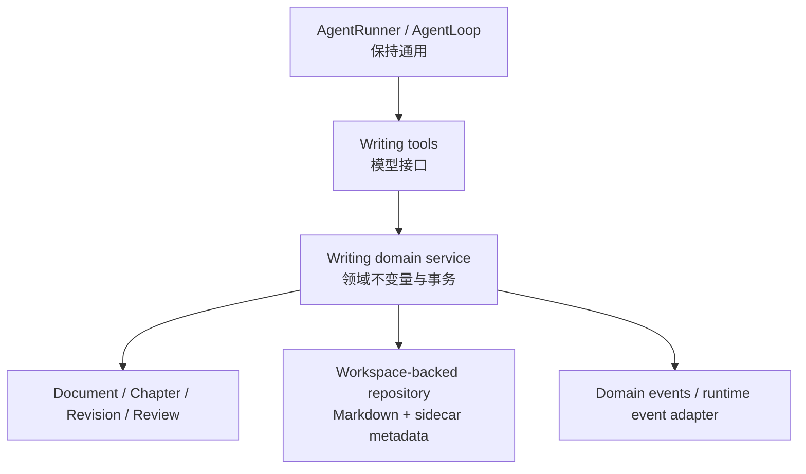

# nanobot 复杂领域 Agent Runtime 能力边界评估

> 评估问题：一个基于 nanobot 的复杂领域 Agent（Writing Agent / Research Agent）目前能做到什么，不能做到什么？
>
> 评估日期：2026-08-02
>
> 评估范围：当前本地工作区代码快照，只读分析；不引用其他项目的领域设计。

## 0. 结论先行

nanobot 当前已经是一个可工作的、通用的 Agent Runtime 内核，而不是一个只有单轮问答能力的聊天封装。它已经具备：

- 异步消息入口和会话路由；
- ReAct 风格的多轮 LLM—Tool 循环；
- 工具发现、JSON Schema、参数校验、并发调度和结果回填；
- 会话 JSONL 持久化、上下文裁剪、自动压缩和长期记忆文件；
- 文件、搜索、Shell、Web、MCP、定时任务、子 Agent 等通用执行能力；
- 工具过程、文件编辑、运行状态等前端可消费事件；
- 当前工作树中还具备持久化工作计划、结构化用户输入，以及针对结构化文件工具的 `read_only / ask / auto` 执行策略。

因此，它可以通过“计划 + 文件 + 多轮工具调用”完成一篇长文的草拟、分章写作、读取和局部修改，也能把过程显示在 WebUI 中。

但 nanobot 仍然只是**通用执行内核**。当前没有一等的 `Document / Chapter / Revision / Review` 领域对象，没有文章级状态机、版本历史、语义 Diff、Review 闭环和可恢复的长程工作流。它能够“操作文章文件”，却还不能原生“管理一篇文章的生命周期”。

最重要的边界可以概括为：

> nanobot 已经解决了“Agent 怎么思考、怎么调用工具、怎么保持会话”；尚未解决“复杂领域成果是什么、如何版本化、如何审核、如何形成可恢复业务流程”。

### 0.1 评估基线说明

当前工作区不是干净的发布版本：`AgentLoop`、`AgentRunner`、Workspace 执行策略、Working Plan、用户交互和 WebUI 卡片等存在未提交代码。本报告按**当前文件快照**评估，不把这些能力表述为已发布或已经过完整发布验证的稳定能力。

本文使用以下措辞区分成熟度：

- **机制存在**：代码路径已经存在，能完成底层动作；
- **基本闭环**：入口、持久化、恢复/反馈和 UI 已经连通；
- **领域能力**：存在稳定领域对象、不变量、版本和业务语义；
- **平台能力**：可配置、可审计、可扩展，并覆盖所有相关工具和入口。

---

# 第一部分：项目整体架构扫描

## 1. 核心启动流程

### 1.1 Gateway 是主要组合根

常驻运行的核心组合发生在 [`nanobot/cli/gateway_runtime.py`](../nanobot/cli/gateway_runtime.py)。`_run_gateway()` 创建并连接：

- `MessageBus`；
- `RuntimeEventBus`；
- `SessionManager`；
- LLM Provider / Runtime；
- `AgentLoop`；
- `ChannelManager`；
- WebUI turn coordinator；
- Cron、local trigger 等外围服务。

随后并发启动 Agent 消费循环、Channel、配置监听和健康服务。关闭时停止这些任务，并对缓存会话执行带 `fsync` 的刷新。

这体现的是“**组合根 + 小内核 + 边缘扩展**”结构：Gateway 负责装配，AgentLoop 负责协调，Runner 只负责模型和工具循环。

### 1.2 用户输入从哪里进入

输入并不只有一种：

1. **Channel 路径**：Telegram、Discord、WebSocket 等 Channel 将平台消息规范化成 `InboundMessage`，发布到 [`nanobot/bus/queue.py`](../nanobot/bus/queue.py) 的入站队列。
2. **WebUI 路径**：浏览器通过 WebSocket Channel 发送消息，最终也进入同一个 MessageBus。
3. **Python SDK 路径**：[`nanobot/nanobot.py`](../nanobot/nanobot.py) 通过 `AgentLoop.process_direct()` 发起直接调用。
4. **OpenAI 兼容 API**：[`nanobot/api/server.py`](../nanobot/api/server.py) 提供 `/v1/chat/completions` 和 `/v1/models`。这是独立的程序化入口，应注意它不等于完整 Gateway Channel 生命周期的简单 HTTP 外壳。
5. **内部触发**：Cron、子 Agent 结果、局部触发器也可生成 `InboundMessage`，重新进入统一处理路径。

### 1.3 Agent Loop 在哪里

[`nanobot/agent/loop.py`](../nanobot/agent/loop.py) 中的 `AgentLoop` 是会话级协调器。它不直接实现所有推理细节，而负责：

- 从 MessageBus 消费消息；
- 推导 session key；
- 建立当前 workspace / provider / request context；
- 处理命令和同会话并发；
- 构建输入上下文；
- 调用 `AgentRunner`；
- 保存 turn；
- 生成 OutboundMessage；
- 发布生命周期事件。

当前 `_process_message()` 的阶段顺序非常清楚：

```text
restore
  -> compact
  -> command
  -> build
  -> run
  -> save
  -> respond
```

这是一条 turn pipeline，但还不是一个可任意配置节点、分支、补偿和回放的通用工作流引擎。

### 1.4 模型调用在哪里发生

模型调用集中在 [`nanobot/agent/runner.py`](../nanobot/agent/runner.py) 的 `AgentRunner._request_model()`：

- 流式路径调用 Provider 的 `chat_stream_with_retry()`；
- 非流式路径调用 `chat_with_retry()`；
- Provider 抽象和重试逻辑在 [`nanobot/providers/base.py`](../nanobot/providers/base.py)。

`AgentLoop` 选择本轮不可变的 `LLMRuntime`，`AgentRunner` 只消费这个快照。这样可以避免配置热更新在一次运行中途改变模型、上下文窗口或生成参数。

### 1.5 Tool Calling 如何执行

1. Runner 把当前 messages 和 `ToolRegistry.get_definitions()` 交给 Provider。
2. Provider 返回普通文本、reasoning 数据和/或 tool calls。
3. Runner 把 assistant tool-call message 加入本轮消息。
4. `ToolRegistry.prepare_call()` 查找工具、整理参数并执行 Schema 校验。
5. Runner 根据工具的并发属性划分批次。
6. 工具执行结果被规范化为 `role=tool` 消息。
7. 结果再次进入模型上下文，开始下一次 iteration。
8. 模型不再请求工具并返回最终文本，或者达到其他停止条件，本轮结束。

### 1.6 一次 Agent Run 的生命周期



更简化地看：

```text
User
  ↓
API / CLI / Channel / WebSocket
  ↓
MessageBus
  ↓
AgentLoop（会话与运行协调）
  ↓
AgentRunner（模型—工具循环）
  ↓
LLM Provider
  ↓ tool_calls
ToolRegistry -> Tool
  ↓ tool result
AgentRunner -> LLM
  ↓ final answer
Session persistence + Event + Outbound response
```

### 1.7 为什么拆成 Loop 与 Runner

这是合理的职责分离：

- `AgentLoop` 面向“消息和会话”；
- `AgentRunner` 面向“一次模型工具运行”；
- `Tool` 面向“外部能力”；
- `Provider` 面向“模型协议差异”。

如果把这些都塞进一个循环，Channel 路由、会话持久化、模型兼容和工具执行会互相污染。相反，若一开始引入重量级 DAG/BPMN 工作流框架，又会把一个小型 Agent Runtime 变成流程平台。当前拆分适合 nanobot 的轻量目标；领域工作流应作为上层扩展，而不是替换 Runner。

---

# 第二部分：Agent Runtime 核心能力

## 2. Agent Loop

### 2.1 ReAct loop 是否存在

**存在，属于 ReAct 风格，而不是显式 ReAct 数据模型。**

Runner 的核心循环会反复执行：

```text
构造受控上下文
  -> 调用 LLM
  -> 读取 tool calls
  -> 执行 tools
  -> 写回 observations
  -> 再次调用 LLM
```

代码没有定义 `Thought / Action / Observation` 三种一等对象，也不要求模型输出固定格式的 Thought。它依赖模型原生 function/tool calling。这比解析自由文本动作可靠，也避免把隐藏推理当业务协议。

### 2.2 是否支持多轮工具调用

**支持。** 每次模型返回一个或多个 tool calls 后，Runner 执行并把结果回填，再进入下一 iteration。

同一批 tool calls 还能按工具属性调度：只读且 `concurrency_safe` 的工具可以并发；互斥或有副作用的工具保持顺序。这比无条件 `gather()` 更安全。

### 2.3 是否支持停止条件

**支持多种停止条件：**

- 模型返回最终文本且无 tool call；
- 达到 `max_iterations`；
- 工具请求用户输入，进入 `waiting_for_user`；
- Provider 或工具错误，根据配置结束；
- 空响应、多次非法 tool call、refusal/content filter 等协议终止；
- 取消、超时或外部停止；
- 输出长度耗尽时尝试 continuation；
- 最大 iteration 后可额外请求一次无工具的收尾回答。

### 2.4 是否有最大 iteration 限制

**有。** `AgentRunSpec.max_iterations` 被用于 Runner 的 `range(spec.max_iterations)`。AgentLoop 从配置读取相应默认值。

这个限制是防止模型—工具无限循环的运行护栏，不是任务完成证明。达到上限只说明“本轮预算耗尽”，不代表领域任务已经成功。

### 2.5 运行恢复边界

Runner 会向 Session 写入 `runtime_checkpoint`，阶段包括：

- `awaiting_tools`；
- `tools_completed`；
- `final_response`。

重启恢复时，未完成工具不会被盲目重放，而会被标记为中断，避免重复副作用。这是一种稳健的**会话 turn 恢复**。

但它不是：

- durable workflow；
- exactly-once tool execution；
- 任务 DAG 的节点恢复；
- 跨多个 turn 的业务补偿机制。

### 2.6 Agent Loop 能力结论

**已有能力：**

- 原生 tool-calling 驱动的 ReAct 风格循环；
- 多轮、单轮多工具；
- 工具并发分组；
- 最大 iteration 与多种终止原因；
- 流式输出、reasoning/tool 过程事件；
- 模型输出续写；
- 本轮 checkpoint 与中断恢复保护；
- 同 session 串行、不同 session 并发；
- 运行中用户输入暂停并在后续 turn 恢复。

**缺失能力：**

- 显式任务图、条件分支和领域状态机；
- 跨多个 turn 的 durable workflow 调度；
- 步骤级重试、补偿、幂等键和 exactly-once 语义；
- 成功条件/质量门禁的统一定义；
- 领域任务的可恢复节点状态；
- 成本、时间、质量等复合预算调度。

## 3. Tool 系统

### 3.1 Tool 如何注册

核心结构是 [`nanobot/agent/tools/registry.py`](../nanobot/agent/tools/registry.py) 的 `ToolRegistry`。

注册来源包括：

1. [`nanobot/agent/tools/loader.py`](../nanobot/agent/tools/loader.py) 用 `pkgutil` 扫描内建工具模块；
2. Python entry point `nanobot.tools` 加载外部插件；
3. MCP 连接后将远端工具包装并加入 Registry；
4. 运行期可动态 `register / unregister`。

`ToolLoader` 还支持 scope，例如 core 与 subagent 工具集合不同。这使新领域能力可以通过新工具或插件加入，而不需要改 Runner。

### 3.2 Tool schema 如何定义

工具继承 [`nanobot/agent/tools/base.py`](../nanobot/agent/tools/base.py) 的 `Tool`，声明：

- `name`；
- `description`；
- `parameters`；
- `execute(**kwargs)`。

`Tool.to_schema()` 转换为模型可识别的 function schema。项目提供 String、Integer、Number、Boolean、Array、Object 等 Schema 类型以及装饰器式定义。

### 3.3 参数如何校验

`ToolRegistry.prepare_call()` 执行：

1. 工具名精确查找；
2. 参数对象整理和有限类型转换；
3. `Tool.cast_params()`；
4. `Tool.validate_params()`；
5. 返回结构化错误或可执行调用。

校验覆盖 required、类型、enum、长度、数值区间、数组 items、对象 additional properties 等。

边界是：这属于 JSON Schema 风格的**接口校验**，不是领域不变量校验。例如“章节 ID 必须存在”“Review 只能引用当前 Revision”仍需领域服务负责。

### 3.4 Tool 返回结果如何进入上下文

工具返回值先由 Registry 统一处理异常和错误格式，然后 Runner 构造：

```json
{
  "role": "tool",
  "tool_call_id": "...",
  "name": "...",
  "content": "..."
}
```

`ContextGovernor` 会对结果做长度控制、非法工具配对修复和必要压缩，再把模型专用副本交给 Provider。持久化 transcript 不会因为模型窗口治理而被直接破坏。

### 3.5 Tool 权限控制

当前权限不是单一机制，而是多层护栏：

- `WorkspaceScope`：项目根、full/restricted 访问模式；
- 路径约束：文件工具检查允许读写根；
- Shell 约束：应用层路径检查，可用时结合系统 sandbox；
- 网络 guard：Web 工具有 SSRF / 目标限制；
- Channel allowlist / pairing：控制消息发送者；
- 工具 scope：控制 core/subagent 是否加载；
- 当前工作树的 `execution_policy`：`read_only / ask / auto`。

`ask` 目前由 `FileMutationPolicyGate` 覆盖结构化文件修改工具。它生成 unified diff、文件前置 hash、proposal fingerprint，并允许用户 `apply_once` 或拒绝；执行前会检查内容是否已变化。

但必须准确描述边界：

> 这不是覆盖所有 Tool 的通用权限引擎，也不是任意副作用的统一审批框架。Shell 命令、远端 MCP 写操作、外部 API 副作用并不会天然获得同样的文件审批语义。

### 3.6 能否支撑常见能力

|目标|现状|边界|
|-|-|-|
|文件操作|足够支撑文本和源码文件 CRUD、搜索、patch|没有文档领域语义；二进制 Office 文档需专用工具|
|文档处理|可把 Markdown/文本当文件处理|没有 DOCX/PDF 结构解析、章节对象、引用对象、格式保真和 Revision|
|外部 API|Web、Shell、CLI App、MCP、新 Tool 均可接入|认证、限流、幂等和副作用审批由具体集成承担|
|子 Agent|支持后台或等待式委派|子 Agent 内部运行状态主要在内存中，不是持久化工作流|

结论：Tool 框架足够作为 Writing/Research Agent 的扩展底座；现有通用工具不足以单独形成成熟领域产品。

## 4. Context Management

### 4.1 不要把三种状态混在一起



### 4.2 短期上下文

短期上下文是每次 Provider 调用的 messages。它主要由 [`nanobot/agent/context.py`](../nanobot/agent/context.py) 构建：

- system identity 和平台信息；
- `AGENTS.md / SOUL.md / USER.md`；
- 工具使用约定；
- `MEMORY.md`；
- always-on 和显式触发 Skills；
- 近期 history 摘要；
- 当前 session 的合法消息尾部；
- 当前用户消息与附件；
- runtime context blocks，例如目标、Working Plan、工作区和其他运行态提示。

随后 [`nanobot/agent/context_governance.py`](../nanobot/agent/context_governance.py) 仅对“发给模型的副本”做治理：

- 丢弃孤立 tool results；
- 修复或剔除非法 tool call 配对；
- 限制/压缩过大工具结果；
- 压缩本轮已消费的工具 observation；
- 当上下文超预算时裁剪历史。

因此 nanobot 确实有 context window 管理，而且不只是固定保留最后 N 条消息。

### 4.3 对话历史存在哪里

[`nanobot/session/manager.py`](../nanobot/session/manager.py) 的 Session 将消息、metadata 和 provider 私有状态保存到 workspace session 目录下的 JSONL 文件。

持久化特点：

- 临时文件写入后 `os.replace()`；
- 可选文件和目录 `fsync`；
- 损坏尾部修复；
- provider 私有 conversation state 与公共 transcript 分开；
- SessionManager 做缓存，但磁盘文件才是重启后的来源。

用户消息在模型运行前就被持久化，从而减少“模型调用很慢或进程中断导致用户输入丢失”的风险。

### 4.4 摘要和自动压缩

[`nanobot/agent/memory.py`](../nanobot/agent/memory.py) 的 `Consolidator` 根据 token 预算挑选完整用户 turn 边界，把较老消息总结到 `memory/history.jsonl`，然后移动 session 的 replay 边界。Provider 总结失败时会退化为原始归档，而不是直接丢弃历史。

[`nanobot/agent/autocompact.py`](../nanobot/agent/autocompact.py) 对空闲达到 TTL 的 session 主动压缩，保留近期合法后缀。

这意味着：

- 有摘要机制；
- 有 context window 管理；
- 有空闲会话压缩；
- 但摘要是有损的，不能作为文章正文、引用证据或业务状态的权威来源。

### 4.5 长期记忆

至少要区分三层：

1. **Session transcript**：某个会话的详细对话和工具消息；
2. **`memory/history.jsonl`**：被压缩的历史摘要/原始归档；
3. **`memory/MEMORY.md`**：Dream 流程整理出的长期事实和偏好。

Dream 会读取尚未处理的 history，通过受限工具更新 `SOUL.md / USER.md / MEMORY.md` 等长期文件。这是“记住用户与经验”的机制，不是 Writing Agent 的文章数据库。

### 4.6 工作空间状态

工作空间状态包括：

- 项目路径下的真实文件；
- 文件 hash、mtime 和当前内容；
- Shell 进程与外部系统状态；
- Git 仓库状态（如果通过 Shell 查询）；
- 当前 workspace scope；
- Session metadata 中的 Goal、Working Plan、interaction request 等。

其中 [`nanobot/agent/tools/file_state.py`](../nanobot/agent/tools/file_state.py) 会记录本运行期读写过的文件 hash/mtime，用来给出 read-before-edit 和 stale-read 警告。但它主要是进程内状态，不是重启后仍可靠的文件索引。

关键边界：

> Agent 并不会自动“知道整个项目现在是什么样”。它拥有搜索、读取和状态提示能力，必须通过工具按需观察。工作空间是真实来源，上下文只是其有限投影。

### 4.7 外部知识注入

**支持多种注入方式：**

- Bootstrap 文件；
- Skills；
- runtime context provider；
- 用户附件；
- Web Search / Web Fetch；
- MCP 工具与资源；
- 自定义 Tool；
- 直接把检索结果作为 tool result 回填。

但没有内建、统一的领域 RAG 管线：文档切分、embedding、索引更新、来源去重、citation lineage 和证据有效期不是 Runtime 的核心能力。

### 4.8 Context 能力结论

**短期上下文：成熟度较高。** 有合法历史、token 预算、工具结果治理、压缩和 runtime context。

**长期记忆：存在通用机制。** 适合偏好、摘要和跨会话事实，不适合保存长文权威状态。

**工作空间状态：可按需观测和修改。** 有路径护栏和运行期文件状态，但没有持久化项目索引、领域资产目录和版本图。

---

# 第三部分：与成熟 Coding Agent 的差距

## 5. 比较方法

Claude Code、Codex、Cursor 的产品能力持续变化。这里不做逐版本功能竞赛，而把三者作为“成熟 Coding Agent”参照：它们通常把项目目录、文件修改、命令执行、Diff/Review、权限边界和恢复体验做成用户可直接理解的产品闭环。

用于校准的官方资料：

- Claude Code 官方 CLI 文档展示了 session resume、目录范围、allowed/disallowed tools、permission mode 和 max turns：[Claude Code CLI reference](https://docs.anthropic.com/en/docs/claude-code/cli-usage)。
- Cursor 官方说明 Checkpoint 是 Agent 改动的本地快照、并非版本控制：[Cursor Checkpoints](https://docs.cursor.com/en/agent/chat/checkpoints)；其 Review UI 支持文件/行级 diff 接受或拒绝：[Cursor Diffs & Review](https://docs.cursor.com/en/agent/review)。
- Codex 官方文档将 code review、集成终端、local/cloud environment、Git worktree、sandbox 和 Agent approvals 作为独立产品能力：[Codex documentation](https://learn.chatgpt.com/docs/features)。

比较结论只用于解释 nanobot 的能力差距，不作为对这些产品内部实现的推断。

## 6. Workspace

### 6.1 项目空间

**支持基础项目空间。** `WorkspaceScope` 包含 project path、访问模式、执行策略和 sandbox 展示状态；WebSocket 可以把 workspace scope 持久化到 session metadata。

边界：Workspace 主要是“路径和权限边界”，不是一等 Workspace Service。没有持续维护的仓库索引、依赖图、语言服务状态、分支/worktree 生命周期和多仓库工作区对象。

### 6.2 文件状态感知

**部分支持。** 文件工具读取时记录 hash/mtime，写入前可检测未读、已变化或陈旧读取；搜索工具支持文件发现和内容检索。

边界：这些状态主要在内存中，且只覆盖已通过结构化文件工具观察的文件。外部编辑、Shell 写文件或重启后，需要重新读取才能建立可信状态。

### 6.3 文件修改

**支持。** `write_file`、`edit_file`、`apply_patch` 和 Shell 都能修改项目。结构化文件工具具有更清晰的路径检查、状态检查、事件和当前执行策略。

### 6.4 文件版本

**没有 Runtime 原生文件版本。**

Agent 可以通过 Shell 使用 Git，但“能调用 Git”不等于 Runtime 拥有 Revision：

- 没有统一 revision ID；
- 没有每次领域修改的 parent/base；
- 没有恢复某文档版本的服务接口；
- 没有将 Review 与某 revision 绑定；
- 非 Git 工作空间也没有替代方案。

### 6.5 Diff

**存在操作级 Diff，但不是完整版本 Diff 系统。**

- 文件编辑事件可向 WebUI 提供编辑 activity；
- `FileMutationPolicyGate` 在 `ask` 模式生成 unified diff 和增删统计；
- 当前 WebUI 有 Change Approval 卡片展示提议。

它缺少：

- 持久化 Change 集合；
- 多文件/多章节聚合；
- revision-to-revision diff；
- 领域语义 diff，例如“论点变化”“引用替换”；
- 按领域对象选择性接受/拒绝。

## 7. Artifact / Document / Revision

### 7.1 当前是否存在

**不存在 Writing 领域的一等对象。**

代码中 [`nanobot/utils/artifacts.py`](../nanobot/utils/artifacts.py) 的 “artifact” 指生成媒体文件的落盘辅助，不是通用 `Artifact` 领域模型。Session、Goal、Working Plan 也不能替代 Document：

- Session 的身份是对话；
- Goal 的身份是长期目标；
- Working Plan 的身份是步骤计划；
- 文件的身份只是路径；
- Document 的身份应是可版本化、可分章节、可 Review 的领域成果。

### 7.2 应该在哪一层增加

应在**Agent 内核之外、Tool 之内侧的领域服务层**增加，而不是改写 Runner：



推荐新增一个边缘包，例如 `nanobot/writing/` 或独立插件，内部拥有：

- 领域模型；
- repository；
- service；
- tools；
- 可选 runtime context provider 和 WebUI adapter。

不要把 Document 内容塞进 Session metadata，也不要把文章生命周期写进 `AgentLoop`。前者会让会话文件膨胀并混淆真相来源，后者会让通用内核绑定写作领域。

## 8. Trace / Event

### 8.1 当前能知道什么

**Agent 当前正在做什么：基本可以。**

[`nanobot/bus/runtime_events.py`](../nanobot/bus/runtime_events.py) 定义了 turn started、run status、turn completed、session persisted、goal/plan/interaction changed 等事件。

[`nanobot/agent/progress_hook.py`](../nanobot/agent/progress_hook.py) 产生工具开始/完成及 reasoning 进度；[`nanobot/agent/hooks/file_edit_activity.py`](../nanobot/agent/hooks/file_edit_activity.py) 产生文件编辑活动；[`nanobot/webui/transcript.py`](../nanobot/webui/transcript.py) 能从持久化进度记录折叠出 trace 消息。

因此前端 Timeline 不只是未来可能性：当前已经有足以显示工具调用、文件编辑、reasoning 片段和 turn 状态的事件材料。

### 8.2 当前不知道什么

- 没有统一、可查询的 TraceStore 和 span 树；
- 没有稳定的跨 turn / 跨 subagent causal graph；
- 不保证所有 Channel 都持久化同等粒度的 timeline；
- tool result 可能被裁剪、脱敏或只保留摘要；
- “为什么下一步这样执行”不属于可靠审计字段。

模型可能流出 reasoning 数据，Working Plan 也能说明计划，但不能把自由文本推理当作可依赖的决策日志。成熟的解释应来自：计划步骤、输入证据、工具调用、结果引用、状态转换和显式 decision record，而不是暴露或依赖模型私有思维链。

### 8.3 Timeline 结论

**支持前端活动 Timeline；不等于已具备通用可观测性平台。** Writing Agent 若增加领域事件，可复用现有 RuntimeEventBus 与 WebUI 折叠模式，不必替换整个事件系统。

## 9. Human-in-the-loop

### 9.1 当前已有的两类机制

1. `request_user_input`：创建持久化结构化 interaction request，Runner 以 `waiting_for_user` 停止；WebSocket 接收回答后解析、写入 Session，并触发新 turn 继续。
2. 文件执行策略：结构化写/编辑/patch 在 `ask` 模式下生成 diff 和 hash 绑定的提议，等待用户一次性应用或拒绝。

### 9.2 对四类需求的判断

|需求|判断|说明|
|-|-|-|
|权限确认|部分支持|Workspace/Channel 有边界，文件写有 ask；不是统一 RBAC/ABAC|
|工具执行审批|局部支持|当前主要覆盖结构化文件修改，不覆盖任意 Tool|
|修改确认|基本支持文件级提议|有 diff、stale 检查和 apply once；无文档 Revision 审批|
|用户反馈重新规划|机制支持|用户输入可恢复新 turn，Working Plan 可更新；没有自动领域重规划器|

因此不能笼统声称“nanobot 已有 Human Approval 平台”。准确说法是：

> 当前工作树有可持久化的人机交互原语，以及一个针对结构化文件修改的审批闭环；通用工具审批和领域审批尚未形成。

## 10. Multi Agent

[`nanobot/agent/subagent.py`](../nanobot/agent/subagent.py) 与 [`nanobot/agent/tools/spawn.py`](../nanobot/agent/tools/spawn.py) 支持：

- 后台委派；
- `wait=true` 的同步咨询；
- 并发数量限制；
- 子 Agent 使用独立 Runner 和受限工具集合；
- 结果重新作为内部消息通知父会话。

适合：并行检索、独立章节草稿、专项 Review。

不适合直接宣称成熟多 Agent 编排，原因是：

- 运行中子任务和内部 transcript 主要在内存；
- 进程重启不能从业务节点继续；
- 没有依赖图、角色协议、共享黑板和冲突合并；
- 父子结果是消息式回传，不是有版本约束的 Artifact 合并；
- 缺少独立质量门和结果验收协议。

---

# 第四部分：Writing Agent 场景评估

## 11. 模拟任务

任务：

> 写一篇 8000 字《Agent Runtime 架构综述》。

评分含义：

- ★★★★★ 完全支持：开箱即用且有完整领域闭环；
- ★★★★ 基本支持：通用机制可稳定完成，仍缺领域体验；
- ★★★ 需要扩展：可搭建出来，但需要少量明确领域资产；
- ★★ 需要较大改造：涉及持久化/流程等关键缺口；
- ★ 当前不存在：没有对应一等能力。

## 12. 分项评估

### 12.1 创建写作计划：★★★★ 基本支持

当前工作树有 `create_working_plan` / `update_working_plan`：

- 可使用 `kind=writing`；
- 步骤和状态持久化在 Session metadata；
- 更新有 `base_version` 乐观并发控制；
- plan 会通过 runtime context 在后续 turn 注入；
- 可在等待用户输入时转为 `waiting_for_user`。

缺口是步骤只有通用文本和状态，不绑定 chapter ID、revision ID、字数预算、依赖和验收标准。

### 12.2 保存长期文章状态：★★★ 需要扩展

当前可以把 Markdown 长文写入 Workspace，文件本身可跨重启存在；计划和对话也会持久化。

但“文章状态”不仅是文件内容，还应包含：

- document identity；
- 章节清单和稳定 ID；
- 当前 revision；
- 目标字数、受众和文风；
- 引用与证据关系；
- Review 状态和批准状态。

这些当前不存在。不能用 `MEMORY.md` 或摘要代替，因为它们是有损记忆，不是文章真相来源。

### 12.3 分章节写作：★★★★ 基本支持

Agent 可以创建计划，把章节分成多个 Markdown 文件，逐章读取/写入，还可用子 Agent 并行起草。

缺口：章节只是路径或标题，没有稳定 chapter ID、顺序不变量、合并规则和跨章一致性检查。

### 12.4 修改指定章节：★★★ 需要扩展

`read_file / edit_file / apply_patch` 足以定位并修改文本，且当前有 stale-read 检查和可选文件审批。

但按标题字符串修改易受重命名、重复标题和全文重排影响。可靠实现需要 chapter ID 和领域服务定位范围；否则只属于文件文本编辑能力。

### 12.5 查看历史版本：★ 当前不存在

Session 能保存对话历史，Git 可通过 Shell 使用，文件审批也会生成某次提议 diff；这些都不是 Document Revision 历史。

当前没有：

- revision 列表；
- parent revision；
- 按 revision 恢复；
- revision 间 diff；
- 修改原因和作者；
- Review/approval 绑定版本。

### 12.6 Review 自己的文章：★★★ 需要扩展

模型可以重新读取全文，按提示检查结构、事实、一致性和表达；也能让子 Agent 做独立 Review。

但 Review 目前只是模型文本，缺少一等 `ReviewFinding`：severity、location、evidence、suggestion、status、target revision 等均没有约束。

### 12.7 根据 Review 修改：★★★ 需要扩展

Agent 能把 Review 文本作为上下文，继续调用文件工具修改文章。

缺口是无法可靠回答：

- 每条 finding 是否已解决；
- 修改应用在哪个 revision；
- 是否引入新问题；
- Review 是否已因新 revision 失效；
- 哪些修改被跳过以及原因。

因此可执行，但不是可审计闭环。

### 12.8 让用户审批修改：★★★ 需要扩展

当前 `ask` 执行策略已经能让结构化文件写操作展示 unified diff，并允许 apply-once 或 reject；`request_user_input` 也能收集结构化反馈。

评分没有给到四星，因为 Writing Agent 需要的是：

- 按 revision/章节审批；
- 一批修改统一预览；
- 局部接受/拒绝；
- 审批后生成新 revision；
- 审批意见进入 Review 闭环。

当前闭环是“某一次文件工具调用是否执行”，而不是“某个文章版本是否批准”。

## 13. 这项任务当前实际会怎样运行

```text
用户提出 8000 字任务
  -> Agent 创建通用 writing plan
  -> 搜索/抓取资料
  -> 把资料结果放入上下文或工作区
  -> 逐章写 Markdown
  -> 上下文过长时压缩对话和工具结果
  -> 重读全文，自我 Review
  -> edit/apply_patch 修改
  -> ask 模式下逐次等待文件变更审批
  -> 返回最终文件路径和总结
```

这条路径可以完成成果，但脆弱点是：

- 文章结构依赖计划文本和文件路径约定；
- 长程状态依赖模型记住并遵守约定；
- 资料证据与正文没有强关联；
- Review 和修改没有机器可验证关系；
- 进程中断只能恢复会话 turn，不一定恢复“写到第几章”的业务步骤；
- 最终质量由提示和模型自觉决定，而不是质量门。

---

# 第五部分：代码级资产定位与推荐扩展点

## 14. 最值得复用的现有资产

|位置|复用价值|Writing Agent 应如何使用|
|-|-|-|
|`nanobot/agent/loop.py`|会话、scope、context、持久化、响应协调|保持不变，承载 turn 生命周期|
|`nanobot/agent/runner.py`|多轮工具循环、停止条件、checkpoint|保持通用，不加入文章字段|
|`nanobot/agent/tools/`|Tool 基类、注册、Schema、文件/Web/子 Agent|增加 Writing tools，复用 Registry|
|`nanobot/agent/context.py`|系统提示、Skills、记忆和当前消息组装|通过 runtime context 注入文章摘要，不注入全文数据库|
|`nanobot/agent/context_governance.py`|工具结果和模型窗口治理|复用；领域工具返回摘要和引用句柄|
|`nanobot/session/`|会话 transcript、metadata、interaction、plan|保存当前活跃 document/revision 引用，不保存全文|
|`nanobot/agent/memory.py`|历史压缩和长期用户偏好|保存偏好/经验，不作为文章权威状态|
|`nanobot/security/workspace_access.py`|Workspace 与执行策略|复用文件范围和 ask/auto/read-only|
|`nanobot/bus/runtime_events.py`|运行生命周期事件|适配少量 writing domain events|
|`nanobot/providers/`|多模型协议适配|领域层不依赖具体 Provider|
|`nanobot/skills/`|提示级写作方法和操作指南|承载写作方法论，不承载状态|
|`nanobot/agent/subagent.py`|并行调研或 Review|用于有界任务，不作为 durable workflow|

## 15. 推荐扩展点

### 15.1 第一选择：新增 Writing 边缘领域包

建议增加独立 `nanobot/writing/` 或外部 plugin，而不是大规模重构现有目录。最小内部边界：

```text
writing/
  models.py       # Document, Chapter, Revision, ReviewFinding 的最小数据结构
  repository.py   # Workspace 文件和 sidecar 元数据读写
  service.py      # 领域不变量、版本创建、review/apply
  tools.py        # 暴露给 LLM 的窄接口
  context.py      # 当前文档/章节/revision 摘要注入
```

### 15.2 Tool 层只做适配，不做业务真相

推荐工具形态：

- `create_document`；
- `get_document_outline`；
- `write_chapter_draft`；
- `revise_chapter`；
- `create_review`；
- `apply_review_findings`；
- `list_revisions`；
- `diff_revisions`。

Tool 负责参数 Schema、RequestContext 和结果格式；Service 负责 chapter/revision 是否存在、base revision 是否过期、Review 是否适用于当前版本等不变量。

如果把所有逻辑直接写在 Tool.execute 中，未来 Web API、CLI 和 WebUI 会被迫复制同样逻辑。

### 15.3 Session 只保存引用

Session metadata 最多保存：

```json
{
  "active_document_id": "doc_xxx",
  "active_revision_id": "rev_xxx",
  "active_chapter_id": "chapter_xxx"
}
```

正文、版本快照和 Review 应由 WritingRepository 管理。这样对话可删除或压缩而不损坏文章，文章也可被多个 session 继续处理。

### 15.4 Workspace-backed repository 适合 MVP

MVP 可用 Markdown + JSON sidecar + 原子替换：

- 与当前文件工具和 workspace 模型一致；
- 用户可直接查看和备份；
- 不引入数据库部署；
- 易于和 Git 共存；
- 后续可替换 repository 实现而不改 Runner。

不建议 MVP 直接引入事件溯源数据库或完整工作流引擎，因为当前首要缺口只是领域身份、版本和 Review 关系。数据库不会自动解决这些建模问题，反而会增加事务、迁移、部署和双重真相来源。

### 15.5 为什么不能只用 Git

Git 很适合文件历史，但不是 Writing Domain Service 的完整替代：

- 并非每个文档修改都应成为仓库 commit；
- commit 不天然知道 chapter、finding 和 approval；
- 工作目录可能有用户未提交修改；
- 非代码用户不应被迫理解分支/commit；
- 一个 commit 可能包含多个文档或非文档文件。

可以让 revision 记录可选 Git commit hash，但不能把 domain revision identity 等同于 Git commit。

### 15.6 为什么不修改 AgentRunner

Writing 能力缺口不是“模型不会多轮调用工具”，而是“工具后面没有文章领域服务”。修改 Runner 会增加通用内核复杂度，却仍然无法得到 chapter/revision/review 不变量。正确扩展点是工具、领域服务、runtime context 和少量事件适配。

---

# 第六部分：最终能力矩阵与 MVP 路线

## 16. 能力矩阵

|能力|nanobot 现状|是否满足 Writing Agent|建议|
|-|-|-|-|
|Agent Loop|ReAct 风格、多轮工具、停止条件、iteration、turn checkpoint|基本满足执行内核|保持通用，不加入写作流程节点|
|Tool Calling|自动发现、插件/MCP、Schema 校验、结果回填、并发分组|满足扩展底座|新增窄 Writing tools，领域校验放 Service|
|Memory|Session JSONL、history 摘要、Dream MEMORY|只能保存会话/偏好，不满足文章真相|文章状态进入独立 repository|
|Context|历史治理、工具结果压缩、Skills/runtime context|基本满足|只注入当前文档摘要和引用，不反复塞全文|
|Workspace|路径 scope、文件工具、搜索、运行期 file state|部分满足|复用为 MVP 存储，增加领域 manifest|
|Artifact|媒体落盘 helper；无 Document/Chapter/Revision|不满足|在边缘领域层增加最小模型|
|Diff|文件 activity 和 ask 模式 unified diff|部分满足文件修改|增加 revision diff 和章节语义定位|
|Review|LLM/子 Agent 可生成文本 Review|不满足可审计闭环|增加 ReviewFinding 并绑定 target revision|
|HITL|结构化用户输入；结构化文件修改 ask/apply-once|部分满足|扩展到 revision/章节审批，不宣称通用审批平台|
|Event Trace|turn、tool、reasoning、file edit、plan/interaction 事件；WebUI 可折叠 timeline|基本满足活动展示|补少量领域事件和稳定关联 ID|
|Multi Agent|后台/等待式子 Agent、并发限制、结果回传|适合有界调研/Review|MVP 非必需；不依赖它保证流程持久化|

## 17. 《基于 nanobot 开发 Writing Agent 的最小路线》

这不是完整平台设计，只是使“8000 字长文”从文件操作升级为最小可管理成果所需的能力。

### P0：必须已有或补充

#### 直接复用

- AgentLoop / AgentRunner；
- ToolRegistry 和 Schema；
- Session 持久化和 ContextGovernor；
- WorkspaceScope 和结构化文件工具；
- Working Plan；
- request_user_input；
- RuntimeEventBus；
- Skills 与 Provider。

#### 最小补充

1. `Document / Chapter / Revision / ReviewFinding` 四个最小领域对象；
2. Workspace-backed WritingRepository，使用 Markdown + sidecar metadata；
3. WritingService 维护稳定 ID、base revision、原子保存和状态不变量；
4. 六到八个窄 Writing tools，禁止模型绕过 service 修改受管文档；
5. 当前 document/revision/chapter 的 runtime context provider；
6. Review 绑定 revision，修改后产生新 revision；
7. revision 级预览与批准，复用现有 interaction/file diff 原语；
8. 每个业务步骤可从 repository 和 plan 推导是否完成，避免只依赖对话记忆。

P0 完成标准不是“模型写出了 8000 字”，而是：进程重启后仍知道当前文档、章节、revision、未处理 Review，并能在不破坏历史的情况下继续。

### P1：增强体验

- WebUI 显示 outline、当前 chapter、revision 和 Review findings；
- 多章节/多文件修改聚合预览；
- finding 的 accept/reject/resolved；
- 字数、引用覆盖、章节一致性等确定性检查；
- 领域事件进入现有 Timeline；
- 子 Agent 用于检索与独立 Review，并对结果做父级验收；
- 外部知识来源和正文引用的 lineage。

### P2：长期方向

- 持久化工作流图与步骤级恢复；
- 可替换数据库 repository；
- 多用户/多文档并发和权限模型；
- 语义 revision diff 与合并；
- 多 Agent 任务依赖图、共享证据库和冲突解决；
- 质量评测、成本预算和可观测 TraceStore。

## 18. 最终判断

### 当前能做到

- 让 Agent 规划、搜索、调用外部能力并连续执行多个步骤；
- 在受控 workspace 中创建、读取和修改长文文件；
- 跨 turn 保持对话、计划、偏好和部分运行状态；
- 对过长上下文做摘要、裁剪和工具结果治理；
- 用子 Agent 做并行检索或独立 Review；
- 在 WebUI 展示工具和文件编辑过程；
- 对结构化文件修改进行有限的执行前确认。

### 当前不能原生做到

- 把文章作为一等 Document 管理；
- 提供 Chapter/Revision/Review 的稳定领域语义；
- 查看、比较、恢复文章历史版本；
- 保证 Review—修改—复审—批准的可审计闭环；
- 在进程重启后从任意业务步骤精确续跑；
- 对所有副作用工具统一审批；
- 提供成熟 Coding Agent 级项目索引、版本/工作树和权限产品体验；
- 将子 Agent 运行视为 durable multi-agent workflow。

### 一句话结论

> nanobot 足以作为 Writing Agent 的 Runtime 内核，但 Writing Agent 本身仍需要一层很薄、很明确的领域服务；最小正确方向是补 Document/Revision/Review，而不是重写 Agent Loop。

---

# 附录 A：关键代码证据索引

|事实|代码位置|
|-|-|
|Gateway 组合根|`nanobot/cli/gateway_runtime.py::_run_gateway`|
|消息队列|`nanobot/bus/queue.py::MessageBus`|
|Turn 阶段流水线|`nanobot/agent/loop.py::_process_message`|
|模型—工具循环|`nanobot/agent/runner.py::AgentRunner._run_core`|
|模型请求|`nanobot/agent/runner.py::_request_model`|
|Provider 重试|`nanobot/providers/base.py::chat_stream_with_retry / chat_with_retry`|
|Tool Registry|`nanobot/agent/tools/registry.py::ToolRegistry`|
|Tool Schema|`nanobot/agent/tools/base.py::Tool`|
|Tool 自动发现|`nanobot/agent/tools/loader.py::ToolLoader`|
|上下文构造|`nanobot/agent/context.py::ContextBuilder`|
|模型窗口治理|`nanobot/agent/context_governance.py::ContextGovernor`|
|Session JSONL|`nanobot/session/manager.py::Session / SessionManager`|
|摘要与长期记忆|`nanobot/agent/memory.py::Consolidator / MemoryStore`|
|空闲压缩|`nanobot/agent/autocompact.py::AutoCompact`|
|Workspace scope|`nanobot/security/workspace_access.py::WorkspaceScope`|
|文件状态|`nanobot/agent/tools/file_state.py::FileStateStore`|
|文件修改执行策略|`nanobot/agent/tools/file_mutation_policy.py::FileMutationPolicyGate`|
|结构化用户输入|`nanobot/agent/tools/user_input.py::RequestUserInputTool`|
|Working Plan|`nanobot/agent/tools/working_plan.py`、`nanobot/session/working_plan.py`|
|运行事件|`nanobot/bus/runtime_events.py::RuntimeEventBus`|
|工具进度|`nanobot/agent/progress_hook.py::AgentProgressHook`|
|文件编辑事件|`nanobot/agent/hooks/file_edit_activity.py::FileEditActivityHook`|
|WebUI Trace 折叠|`nanobot/webui/transcript.py`|
|子 Agent|`nanobot/agent/subagent.py::SubagentManager`|

# 附录 B：面试追问题与推荐回答

## Q1：nanobot 是不是一个工作流引擎？

推荐回答：

> 它首先是消息驱动的 Agent Runtime。AgentLoop 有固定 turn pipeline，Runner 有多轮工具循环，也有 turn checkpoint、计划和长期目标，但没有可配置 DAG、节点级持久化、补偿和 exactly-once，所以不能把它等同于 durable workflow engine。

## Q2：为什么说它有 ReAct，又没有 ReAct 对象？

推荐回答：

> 行为上是 Reason/Act/Observe 的循环：模型决定工具、Runtime 执行、结果回填再推理；协议上依赖模型原生 tool calling，不解析 Thought/Action 文本，因此没有显式 Thought 对象。这样更可靠，也避免把私有推理当业务接口。

## Q3：Session、Memory 和 Workspace 有什么区别？

推荐回答：

> Session 是会话 transcript 和本轮 metadata；Memory 是被摘要的历史及长期偏好事实；Workspace 是当前真实文件和外部状态。上下文只是这三者在一次模型调用中的有限投影。文章正文应放 Workspace 的领域 repository，不能放摘要记忆。

## Q4：为什么不直接用聊天历史保存文章？

推荐回答：

> 聊天历史会被裁剪和有损摘要，也混有工具协议消息；它的身份是对话，不支持稳定章节 ID、版本、Review 和恢复。对话可以解释过程，但不能成为领域成果的 source of truth。

## Q5：nanobot 有没有 Human-in-the-loop？

推荐回答：

> 当前工作树有两个原语：持久化 request_user_input，以及结构化文件修改的 ask/apply-once/reject。前者解决暂停问人，后者解决单次文件变更确认。但它还不是覆盖任意 Tool 的统一审批平台，也没有文章 revision 级审批。

## Q6：为什么 Writing Agent 不需要重写 AgentRunner？

推荐回答：

> Runner 已经能稳定完成多轮模型—工具循环。Writing 的主要缺口是 Document、Chapter、Revision、Review 的身份和不变量，应在领域 Service 和 Tool 后端补齐。改 Runner 会把通用内核领域化，却不能解决版本和审核语义。

## Q7：有 Git 为什么还需要 Revision？

推荐回答：

> Git 管文件快照，领域 Revision 管文章语义。Revision 需要知道 document、chapter、parent、Review 和 approval；Git commit 可能混入其他文件，也不适合所有用户。两者可以关联，但不能等同。

## Q8：当前最大的生产风险是什么？

推荐回答：

> 对复杂领域任务，最大风险不是 LLM 不会调用工具，而是把“会话记住了”和“业务状态已持久化”混为一谈。进程重启、上下文压缩或用户并发修改后，缺少稳定领域对象会导致重复写作、覆盖和 Review 失效。
