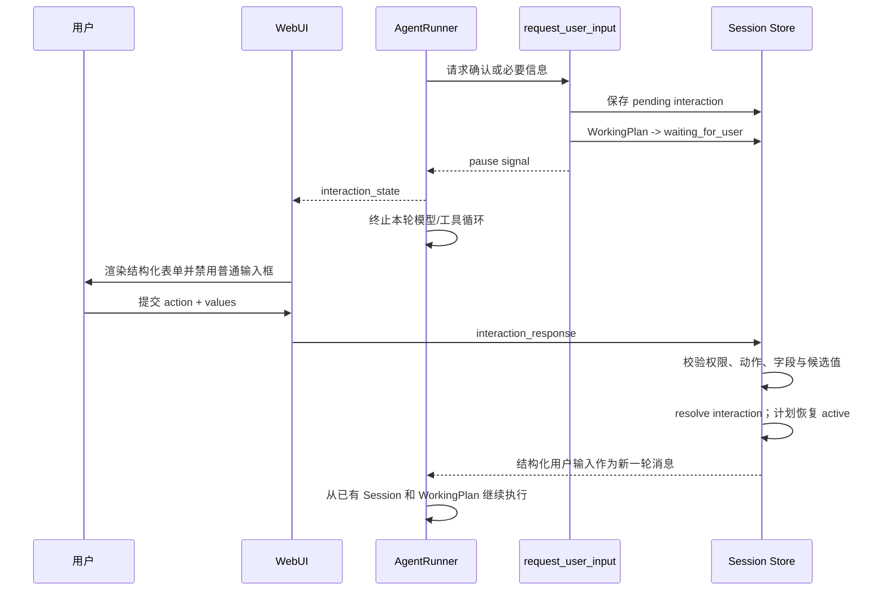

# WorkingPlan 与 Human-in-the-Loop 设计

> 状态：首个可运行版本已实现于 `codex/working-plan-hitl`  
> 范围：通用任务规划、写作计划语义、结构化用户确认、WebUI 暂停与恢复

## 1. 核心决策

`Goal`、`WorkingPlan` 和 `WritingPlan` 是三个不同层次：

- `Goal` 表示需要跨轮次持续推进的长期目标，可选；
- `WorkingPlan` 表示当前复杂任务的可执行计划，不依赖 `/goal`；
- `WritingPlan` 不是另一套互斥运行时，而是 `WorkingPlan.kind = "writing"` 的领域形态。

因此，普通多步骤任务可以建立 WorkingPlan；当任务被识别为写作任务，或用户把任务切换为写作工作流时，同一份计划以 WritingPlan 语义展示和更新。简单的一步问答不强制创建计划。

## 2. 当前数据模型

WorkingPlan 持久化在 Session metadata 中，包含：

- 稳定 `id` 与递增 `version`；
- `kind`：`general` 或 `writing`；
- `status`：`draft`、`active`、`waiting_for_user`、`completed`、`cancelled`；
- 目标、标题和有序步骤；
- 每个步骤的稳定标识、描述和状态。

更新采用 `base_version` 乐观并发检查，避免过期的模型调用覆盖较新的用户操作。

InteractionRequest 同样持久化在 Session metadata 中，包含表单标题、原因、字段、动作、关联计划版本和待处理状态。支持文本、多行文本、单选、下拉、多选和确认控件。

## 3. 运行时行为

等待期间，后端拒绝普通 WebSocket 消息，避免用户绕开表单造成两个并行恢复路径。页面刷新或重新订阅会话后，服务端会重新下发 WorkingPlan 和尚未处理的 InteractionRequest。

## 4. 工具职责

- `create_working_plan`：为多步骤任务创建或替换计划；
- `update_working_plan`：按版本更新计划与步骤状态；
- `request_user_input`：创建持久化表单并暂停运行；
- `/goal` 及持续目标工具：仍只负责跨轮自动推进，不再承担通用计划数据模型。

WorkingPlan 的 runtime context provider 会提示模型：复杂任务先规划并持续更新；写作任务使用 `kind=writing`；简单任务无需为了形式创建计划。

## 5. 前端行为

- 输入框上方显示可展开的 Working Plan / Writing Plan 卡片、完整步骤和完成进度；
- 活跃计划默认展开；完成或取消后保留为折叠回执，可重新展开检查每一步；
- 用户可以手动关闭计划回执；若未关闭，发起下一条普通 query 时自动隐藏旧回执；
- 存在待处理交互时显示表单，并暂时禁用普通消息编辑器；
- 表单提交采用专用 `interaction_response` WebSocket envelope；
- WebSocket Client 按会话缓存计划与交互快照；
- 订阅会话时由后端重新水合，刷新页面不会丢失确认点。

## 6. 后续迭代

当前版本建立的是运行时骨架，下一阶段可继续补充：

1. 独立的计划抽屉，支持用户直接调整步骤、顺序和状态；
2. WritingPlan 的章节、字数、资料需求、引用状态和审校门禁等领域字段；
3. 非 WebSocket Channel 的文本式交互解析与恢复；
4. InteractionRequest 超时、撤销和多端竞争提交策略；
5. REST 计划快照接口，以及计划历史和审计时间线；
6. 让用户在普通任务中显式执行“转为写作计划”。
